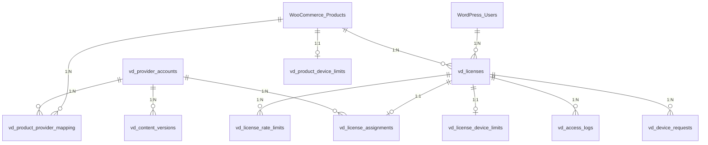

# VD License Manager - Database Schema

## 📋 Table of Contents
1. [Schema Overview](#schema-overview)
2. [Core Tables](#core-tables)
3. [Relationship Diagram](#relationship-diagram)
4. [Indexes & Performance](#indexes--performance)
5. [Migration Scripts](#migration-scripts)
6. [Data Examples](#data-examples)

---

## 🗄️ Schema Overview

### Database Requirements
```bash
MySQL: >= 5.7 (hoặc MariaDB >= 10.3)
Storage Engine: InnoDB (required for foreign keys)
Character Set: utf8mb4
Collation: utf8mb4_unicode_ci
```

### Total Tables: 14
- **Provider Management**: 2 tables
- **License Management**: 5 tables (bổ sung assignment history & settings)
- **Device Management**: 2 tables
- **Rate Limiting**: 2 tables
- **Settings Management**: 2 tables (product & license settings)
- **Field Sharing Configuration**: 1 table (cấu hình trường chia sẻ)
- **Audit Trail**: 1 table

---

## 📊 Core Tables

### 1. Provider Accounts
```sql
CREATE TABLE vd_provider_accounts (
  id BIGINT UNSIGNED AUTO_INCREMENT PRIMARY KEY,
  provider ENUM('helium10','midjourney','freepik') NOT NULL,
  share_type ENUM('cookie','credentials','credentials_2fa') NOT NULL,
  account_name VARCHAR(255) NOT NULL,
  capacity INT UNSIGNED NOT NULL DEFAULT 10,
  current_load INT UNSIGNED NOT NULL DEFAULT 0,
  status ENUM('active','inactive','maintenance') NOT NULL DEFAULT 'active',
  created_at DATETIME NOT NULL DEFAULT CURRENT_TIMESTAMP,
  updated_at DATETIME NOT NULL DEFAULT CURRENT_TIMESTAMP ON UPDATE CURRENT_TIMESTAMP,
  INDEX idx_provider_status (provider, status)
) ENGINE=InnoDB DEFAULT CHARSET=utf8mb4;
```

**Purpose**: Quản lý các tài khoản provider (Helium10, Midjourney, Freepik)
**Key Fields**:
- `capacity`: Số license tối đa có thể assign
- `current_load`: Số license hiện tại đang assigned
- `status`: Trạng thái hoạt động

### 2. Content Versions (Mở rộng với đầy đủ thông tin tài khoản)
```sql
CREATE TABLE vd_content_versions (
  id BIGINT UNSIGNED AUTO_INCREMENT PRIMARY KEY,
  provider_account_id BIGINT UNSIGNED NOT NULL,
  version_number INT UNSIGNED NOT NULL,
  content_type ENUM('cookie','credentials','credentials_2fa') NOT NULL,
  content_data MEDIUMTEXT NOT NULL,              -- Không mã hóa, lưu plain text

  -- Thông tin đăng nhập chính
  email VARCHAR(255) NULL,                       -- Email đăng nhập
  password VARCHAR(255) NULL,                    -- Mật khẩu đăng nhập plain text
  twofa_code VARCHAR(10) NULL,                   -- Mã 2FA hiện tại
  cookies LONGTEXT NULL,                         -- Cookie string plain text

  -- Thông tin khôi phục
  recovery_email VARCHAR(255) NULL,              -- Email khôi phục
  recovery_password VARCHAR(255) NULL,           -- Mật khẩu khôi phục plain text
  recovery_twofa_code VARCHAR(10) NULL,          -- Mã 2FA khôi phục

  -- Thông tin tài khoản mở rộng
  account_registration_date DATE NULL,           -- Ngày đăng ký của tài khoản
  account_expiry_date DATE NULL,                -- Ngày hết hạn của tài khoản
  registration_amount DECIMAL(10,2) NULL,        -- Số tiền đăng ký
  product_id BIGINT UNSIGNED NULL,              -- Product ID liên quan
  status ENUM('active','suspended','archived','expired') NOT NULL DEFAULT 'active',
  assigned_licenses_count INT UNSIGNED NOT NULL DEFAULT 0,  -- Số license hiện đang gán
  last_checked_at DATETIME NULL,                -- Lần cuối kiểm tra cookie còn hợp lệ
  last_success_at DATETIME NULL,                -- Lần lấy cookie thành công gần nhất
  error_count INT UNSIGNED NOT NULL DEFAULT 0,  -- Số lỗi khi fetch cookie
  notes TEXT NULL,                              -- Ghi chú về tài khoản

  -- System fields
  content_hash VARCHAR(64) NOT NULL,
  format ENUM('json','netscape','headers','plain') NOT NULL DEFAULT 'json',
  scope VARCHAR(255) NULL,
  expires_at DATETIME NULL,
  is_active TINYINT(1) NOT NULL DEFAULT 1,
  created_at DATETIME NOT NULL DEFAULT CURRENT_TIMESTAMP,
  updated_at DATETIME NOT NULL DEFAULT CURRENT_TIMESTAMP ON UPDATE CURRENT_TIMESTAMP,

  UNIQUE KEY uq_account_version (provider_account_id, version_number),
  INDEX idx_active_content (provider_account_id, is_active),
  INDEX idx_status (status),
  INDEX idx_product_id (product_id),
  INDEX idx_last_checked (last_checked_at),
  INDEX idx_error_count (error_count),
  FOREIGN KEY (provider_account_id) REFERENCES vd_provider_accounts(id) ON DELETE CASCADE
) ENGINE=InnoDB DEFAULT CHARSET=utf8mb4;
```

**Purpose**: Lưu trữ đầy đủ thông tin tài khoản với khả năng cấu hình chia sẻ
**Key Fields**:
- **Login Info**: `email`, `password`, `twofa_code`, `cookies`
- **Recovery Info**: `recovery_email`, `recovery_password`, `recovery_twofa_code`
- **Account Meta**: `account_registration_date`, `account_expiry_date`, `registration_amount`
- **Operational**: `assigned_licenses_count`, `last_checked_at`, `last_success_at`, `error_count`
- **Note**: Tất cả dữ liệu nhạy cảm lưu plain text theo yêu cầu

### 3. Licenses (Core)
```sql
CREATE TABLE vd_licenses (
  id BIGINT UNSIGNED AUTO_INCREMENT PRIMARY KEY,
  license_key VARCHAR(64) NOT NULL UNIQUE,
  product_id BIGINT UNSIGNED NOT NULL,         -- WooCommerce product_id
  order_id BIGINT UNSIGNED NULL,               -- WooCommerce order_id
  user_id BIGINT UNSIGNED NULL,                -- WordPress user_id
  status ENUM('active','expired','suspended') NOT NULL DEFAULT 'active',
  max_devices INT UNSIGNED NULL,               -- Override device limit cho license này
  expires_at DATETIME NULL,
  created_at DATETIME NOT NULL DEFAULT CURRENT_TIMESTAMP,
  updated_at DATETIME NOT NULL DEFAULT CURRENT_TIMESTAMP ON UPDATE CURRENT_TIMESTAMP,
  INDEX idx_product_id (product_id),
  INDEX idx_status_expires (status, expires_at),
  INDEX idx_user_id (user_id)
) ENGINE=InnoDB DEFAULT CHARSET=utf8mb4;
```

**Purpose**: Core license management với WooCommerce integration
**Key Fields**:
- `license_key`: Unique license identifier
- `product_id`: Link to WooCommerce product
- `max_devices`: Override device limit (NULL = use product default)

### 4. License Assignments (Sticky)
```sql
CREATE TABLE vd_license_assignments (
  id BIGINT UNSIGNED AUTO_INCREMENT PRIMARY KEY,
  license_id BIGINT UNSIGNED NOT NULL,
  provider_account_id BIGINT UNSIGNED NOT NULL,
  assigned_at DATETIME NOT NULL DEFAULT CURRENT_TIMESTAMP,
  assigned_by BIGINT UNSIGNED NULL,                       -- User ID của admin thực hiện
  last_accessed DATETIME NULL,
  status ENUM('active','migrating','inactive') NOT NULL DEFAULT 'active',
  assignment_method ENUM('auto','manual') NOT NULL DEFAULT 'auto',
  change_reason TEXT NULL,                                -- Lý do thay đổi assignment
  UNIQUE KEY uq_license_assignment (license_id),
  INDEX idx_account_load (provider_account_id, status),
  INDEX idx_assigned_by (assigned_by),
  FOREIGN KEY (license_id) REFERENCES vd_licenses(id) ON DELETE CASCADE,
  FOREIGN KEY (provider_account_id) REFERENCES vd_provider_accounts(id),
  FOREIGN KEY (assigned_by) REFERENCES wp_users(ID) ON DELETE SET NULL
) ENGINE=InnoDB DEFAULT CHARSET=utf8mb4;
```

**Purpose**: Sticky assignment - mỗi license gắn với 1 provider account
**Key Fields**:
- `status`: active, migrating (khi đang chuyển account), inactive
- `assigned_by`: Admin user thực hiện assignment thủ công
- `assignment_method`: auto (tự động) hoặc manual (admin chọn)
- `change_reason`: Ghi chú lý do thay đổi tài khoản

### 5. Product Provider Mapping
```sql
CREATE TABLE vd_product_provider_mapping (
  id BIGINT UNSIGNED AUTO_INCREMENT PRIMARY KEY,
  product_id BIGINT UNSIGNED NOT NULL,
  provider_account_id BIGINT UNSIGNED NOT NULL,
  allocation_strategy ENUM('round_robin','least_loaded','sequential') NOT NULL DEFAULT 'least_loaded',
  priority INT NOT NULL DEFAULT 1,              -- Thứ tự ưu tiên (1 = cao nhất)
  is_active TINYINT(1) NOT NULL DEFAULT 1,
  created_at DATETIME NOT NULL DEFAULT CURRENT_TIMESTAMP,
  updated_at DATETIME NOT NULL DEFAULT CURRENT_TIMESTAMP ON UPDATE CURRENT_TIMESTAMP,
  UNIQUE KEY uq_product_provider_priority (product_id, provider_account_id, priority),
  INDEX idx_product_active (product_id, is_active),
  FOREIGN KEY (provider_account_id) REFERENCES vd_provider_accounts(id) ON DELETE CASCADE
) ENGINE=InnoDB DEFAULT CHARSET=utf8mb4;
```

**Purpose**: Cấu hình providers nào được sử dụng cho product nào
**Key Fields**:
- `allocation_strategy`: Cách chọn provider (least_loaded, sequential, round_robin)
- `priority`: Thứ tự ưu tiên khi có nhiều provider cùng strategy

### 6. Device Requests
```sql
CREATE TABLE vd_device_requests (
  id BIGINT UNSIGNED AUTO_INCREMENT PRIMARY KEY,
  license_id BIGINT UNSIGNED NOT NULL,
  device_fp VARCHAR(64) NOT NULL,
  device_info JSON NOT NULL,
  risk_score DECIMAL(5,2) NOT NULL DEFAULT 0.00,
  auto_approved TINYINT(1) NOT NULL DEFAULT 0,
  status ENUM('pending','approved','blocked','over_limit') NOT NULL DEFAULT 'pending',
  ip_address VARCHAR(45) NOT NULL,
  user_agent TEXT NOT NULL,
  country_code VARCHAR(2) NULL,
  first_seen DATETIME NOT NULL DEFAULT CURRENT_TIMESTAMP,
  approved_at DATETIME NULL,
  approved_by BIGINT UNSIGNED NULL,
  notes TEXT NULL,
  UNIQUE KEY uq_license_device (license_id, device_fp),
  INDEX idx_status (status),
  INDEX idx_auto_approved (auto_approved),
  FOREIGN KEY (license_id) REFERENCES vd_licenses(id) ON DELETE CASCADE
) ENGINE=InnoDB DEFAULT CHARSET=utf8mb4;
```

**Purpose**: Quản lý device approval với risk scoring
**Key Fields**:
- `device_fp`: SHA-256 device fingerprint
- `device_info`: JSON containing browser, OS, screen resolution, etc.
- `risk_score`: 0-100, calculated based on various factors
- `status`: pending (cần approve), approved, blocked, over_limit (grace period)

### 7. Product Settings (Cài đặt cho Product)
```sql
CREATE TABLE vd_product_settings (
  id BIGINT UNSIGNED AUTO_INCREMENT PRIMARY KEY,
  product_id BIGINT UNSIGNED NOT NULL,
  max_devices INT UNSIGNED NOT NULL DEFAULT 3,            -- Số thiết bị cho phép
  rate_limit_requests INT UNSIGNED NOT NULL DEFAULT 100,  -- Số request cho phép
  rate_limit_window_hours INT UNSIGNED NOT NULL DEFAULT 1, -- Khung thời gian (giờ)
  auto_approval_enabled TINYINT(1) NOT NULL DEFAULT 1,
  grace_period_hours INT UNSIGNED NOT NULL DEFAULT 72,
  created_at DATETIME NOT NULL DEFAULT CURRENT_TIMESTAMP,
  updated_at DATETIME NOT NULL DEFAULT CURRENT_TIMESTAMP ON UPDATE CURRENT_TIMESTAMP,
  UNIQUE KEY uq_product (product_id),
  INDEX idx_product_settings (product_id)
) ENGINE=InnoDB DEFAULT CHARSET=utf8mb4;
```

**Purpose**: Cài đặt mặc định cho từng product (thiết bị + rate limiting)

### 8. License Settings Override (Ghi đè cài đặt cho License cụ thể)
```sql
CREATE TABLE vd_license_settings_override (
  id BIGINT UNSIGNED AUTO_INCREMENT PRIMARY KEY,
  license_id BIGINT UNSIGNED NOT NULL,
  max_devices INT UNSIGNED NULL,                          -- NULL = dùng product setting
  rate_limit_requests INT UNSIGNED NULL,                  -- NULL = dùng product setting
  rate_limit_window_hours INT UNSIGNED NULL,              -- NULL = dùng product setting
  auto_approval_enabled TINYINT(1) NULL,                 -- NULL = dùng product setting
  grace_period_hours INT UNSIGNED NULL,                  -- NULL = dùng product setting
  notes TEXT NULL,                                        -- Ghi chú lý do override
  created_at DATETIME NOT NULL DEFAULT CURRENT_TIMESTAMP,
  updated_at DATETIME NOT NULL DEFAULT CURRENT_TIMESTAMP ON UPDATE CURRENT_TIMESTAMP,
  UNIQUE KEY uq_license (license_id),
  FOREIGN KEY (license_id) REFERENCES vd_licenses(id) ON DELETE CASCADE,
  INDEX idx_license_override (license_id)
) ENGINE=InnoDB DEFAULT CHARSET=utf8mb4;
```

**Purpose**: Override cài đặt cho license cụ thể
**Logic**: License Settings > Product Settings > Global Settings

### 9. License Assignment History (Lịch sử thay đổi tài khoản)
```sql
CREATE TABLE vd_license_assignment_history (
  id BIGINT UNSIGNED AUTO_INCREMENT PRIMARY KEY,
  license_id BIGINT UNSIGNED NOT NULL,
  old_provider_account_id BIGINT UNSIGNED NULL,           -- Tài khoản cũ (NULL = lần đầu)
  new_provider_account_id BIGINT UNSIGNED NOT NULL,       -- Tài khoản mới
  changed_by BIGINT UNSIGNED NOT NULL,                    -- Admin user thực hiện
  change_method ENUM('manual','auto_rebalance','failover') NOT NULL,
  change_reason TEXT NULL,                                -- Lý do thay đổi
  old_account_name VARCHAR(255) NULL,                     -- Tên tài khoản cũ (backup)
  new_account_name VARCHAR(255) NOT NULL,                 -- Tên tài khoản mới (backup)
  created_at DATETIME NOT NULL DEFAULT CURRENT_TIMESTAMP,
  INDEX idx_license_history (license_id, created_at),
  INDEX idx_changed_by (changed_by),
  INDEX idx_provider_changes (new_provider_account_id, created_at),
  FOREIGN KEY (license_id) REFERENCES vd_licenses(id) ON DELETE CASCADE,
  FOREIGN KEY (old_provider_account_id) REFERENCES vd_provider_accounts(id) ON DELETE SET NULL,
  FOREIGN KEY (new_provider_account_id) REFERENCES vd_provider_accounts(id) ON DELETE CASCADE,
  FOREIGN KEY (changed_by) REFERENCES wp_users(ID) ON DELETE CASCADE
) ENGINE=InnoDB DEFAULT CHARSET=utf8mb4;
```

**Purpose**: Theo dõi lịch sử thay đổi tài khoản cho license
**Key Fields**:
- `change_method`: manual (admin), auto_rebalance (tự động), failover (tài khoản lỗi)
- `old_account_name`, `new_account_name`: Backup tên tài khoản (phòng khi xóa record)

### 10. Access Logs
```sql
CREATE TABLE vd_access_logs (
  id BIGINT UNSIGNED AUTO_INCREMENT PRIMARY KEY,
  license_id BIGINT UNSIGNED NOT NULL,
  device_fp VARCHAR(64) NOT NULL,
  provider_account_id BIGINT UNSIGNED NULL,
  ip_address VARCHAR(45) NOT NULL,
  user_agent TEXT NOT NULL,
  country_code VARCHAR(2) NULL,
  content_version INT UNSIGNED NULL,
  response_time_ms INT UNSIGNED NULL,
  status ENUM('success','fail','blocked','rate_limited','device_limit_exceeded','content_changed_bypass') NOT NULL,
  created_at DATETIME NOT NULL DEFAULT CURRENT_TIMESTAMP,
  INDEX idx_license_device (license_id, device_fp),
  INDEX idx_created_at (created_at),
  INDEX idx_status (status),
  FOREIGN KEY (license_id) REFERENCES vd_licenses(id) ON DELETE CASCADE
) ENGINE=InnoDB DEFAULT CHARSET=utf8mb4;
```

**Purpose**: Comprehensive access logging cho analytics và monitoring

### 11. Rate Limiting
```sql
CREATE TABLE vd_license_rate_limits (
  id BIGINT UNSIGNED AUTO_INCREMENT PRIMARY KEY,
  license_id BIGINT UNSIGNED NOT NULL,
  window_seconds INT NOT NULL DEFAULT 300,
  max_hits INT NOT NULL DEFAULT 10,
  last_reset DATETIME NOT NULL DEFAULT CURRENT_TIMESTAMP,
  current_count INT NOT NULL DEFAULT 0,
  last_content_hash VARCHAR(64) NULL,
  bypass_on_content_change TINYINT(1) NOT NULL DEFAULT 1,
  created_at DATETIME NOT NULL DEFAULT CURRENT_TIMESTAMP,
  updated_at DATETIME NOT NULL DEFAULT CURRENT_TIMESTAMP ON UPDATE CURRENT_TIMESTAMP,
  UNIQUE KEY uq_license_window (license_id, window_seconds),
  INDEX idx_reset_time (last_reset),
  FOREIGN KEY (license_id) REFERENCES vd_licenses(id) ON DELETE CASCADE
) ENGINE=InnoDB DEFAULT CHARSET=utf8mb4;

CREATE TABLE vd_rate_limit_configs (
  id BIGINT UNSIGNED AUTO_INCREMENT PRIMARY KEY,
  entity_type ENUM('product','license','global') NOT NULL,
  entity_id BIGINT UNSIGNED NULL,
  window_seconds INT NOT NULL DEFAULT 300,
  max_hits INT NOT NULL DEFAULT 10,
  bypass_on_content_change TINYINT(1) NOT NULL DEFAULT 1,
  created_at DATETIME NOT NULL DEFAULT CURRENT_TIMESTAMP,
  UNIQUE KEY uq_entity_config (entity_type, entity_id)
) ENGINE=InnoDB DEFAULT CHARSET=utf8mb4;
```

### 12. Global Settings (Cài đặt toàn cục)
```sql
CREATE TABLE vd_global_settings (
  id BIGINT UNSIGNED AUTO_INCREMENT PRIMARY KEY,
  setting_key VARCHAR(100) NOT NULL,
  setting_value TEXT NOT NULL,
  setting_type ENUM('string','integer','boolean','json') NOT NULL DEFAULT 'string',
  description TEXT NULL,
  created_at DATETIME NOT NULL DEFAULT CURRENT_TIMESTAMP,
  updated_at DATETIME NOT NULL DEFAULT CURRENT_TIMESTAMP ON UPDATE CURRENT_TIMESTAMP,
  UNIQUE KEY uq_setting_key (setting_key)
) ENGINE=InnoDB DEFAULT CHARSET=utf8mb4;
```

**Purpose**: Cài đặt mặc định toàn cục
**Sample Data**:
```sql
INSERT INTO vd_global_settings (setting_key, setting_value, setting_type, description) VALUES
('default_max_devices', '3', 'integer', 'Số thiết bị mặc định cho product mới'),
('default_rate_limit_requests', '100', 'integer', 'Số request mặc định'),
('default_rate_limit_window_hours', '1', 'integer', 'Khung thời gian mặc định (giờ)'),
('auto_approval_enabled', 'true', 'boolean', 'Tự động approve thiết bị mới'),
('grace_period_hours', '72', 'integer', 'Thời gian gia hạn (giờ)');
```

### 13. Product Field Sharing Configuration (Cấu hình trường chia sẻ theo sản phẩm)
```sql
CREATE TABLE vd_product_field_sharing_config (
  id BIGINT UNSIGNED AUTO_INCREMENT PRIMARY KEY,
  product_id BIGINT UNSIGNED NOT NULL,
  field_name VARCHAR(100) NOT NULL,              -- Tên trường cần chia sẻ
  is_shared TINYINT(1) NOT NULL DEFAULT 0,       -- 1 = chia sẻ, 0 = không chia sẻ
  display_name VARCHAR(255) NULL,                -- Tên hiển thị cho khách hàng
  sort_order INT UNSIGNED NOT NULL DEFAULT 0,     -- Thứ tự hiển thị
  is_sensitive TINYINT(1) NOT NULL DEFAULT 0,    -- Đánh dấu trường nhạy cảm
  created_at DATETIME NOT NULL DEFAULT CURRENT_TIMESTAMP,
  updated_at DATETIME NOT NULL DEFAULT CURRENT_TIMESTAMP ON UPDATE CURRENT_TIMESTAMP,
  UNIQUE KEY uq_product_field (product_id, field_name),
  INDEX idx_product_shared (product_id, is_shared),
  INDEX idx_sort_order (product_id, sort_order)
) ENGINE=InnoDB DEFAULT CHARSET=utf8mb4;
```

**Purpose**: Cấu hình từng trường thông tin nào sẽ được chia sẻ cho khách hàng theo product
**Key Fields**:
- `field_name`: Tên trường database (email, password, recovery_email, etc.)
- `is_shared`: Có chia sẻ trường này cho khách hàng không
- `display_name`: Tên hiển thị thân thiện cho khách hàng
- `sort_order`: Thứ tự hiển thị trong response
- `is_sensitive`: Đánh dấu trường nhạy cảm (password, 2fa, etc.)

**Sample Data**:
```sql
-- Cấu hình cho sản phẩm 8210
INSERT INTO vd_product_field_sharing_config (product_id, field_name, is_shared, display_name, sort_order, is_sensitive) VALUES
(8210, 'email', 1, 'Email đăng nhập', 1, 0),
(8210, 'password', 1, 'Mật khẩu', 2, 1),
(8210, 'twofa_code', 1, 'Mã 2FA', 3, 1),
(8210, 'cookies', 1, 'Cookie đăng nhập', 4, 1),
(8210, 'recovery_email', 0, 'Email khôi phục', 5, 0),         -- Không chia sẻ
(8210, 'recovery_password', 0, 'Mật khẩu khôi phục', 6, 1),   -- Không chia sẻ
(8210, 'recovery_twofa_code', 0, 'Mã 2FA khôi phục', 7, 1),  -- Không chia sẻ
(8210, 'account_registration_date', 1, 'Ngày đăng ký', 8, 0),
(8210, 'account_expiry_date', 1, 'Ngày hết hạn', 9, 0),
(8210, 'registration_amount', 1, 'Số tiền đăng ký', 10, 0),
(8210, 'status', 1, 'Trạng thái tài khoản', 11, 0),
(8210, 'assigned_licenses_count', 1, 'Số license gán', 12, 0),
(8210, 'last_checked_at', 1, 'Lần check cuối', 13, 0),
(8210, 'last_success_at', 1, 'Lần thành công cuối', 14, 0),
(8210, 'error_count', 1, 'Số lỗi', 15, 0),
(8210, 'notes', 1, 'Ghi chú', 16, 0);
```

### 14. Audit Trail
```sql
CREATE TABLE vd_audit_logs (
  id BIGINT UNSIGNED AUTO_INCREMENT PRIMARY KEY,
  entity_type VARCHAR(50) NOT NULL,
  entity_id BIGINT UNSIGNED NOT NULL,
  action VARCHAR(100) NOT NULL,
  old_values JSON NULL,
  new_values JSON NULL,
  user_id BIGINT UNSIGNED NULL,
  ip_address VARCHAR(45) NOT NULL,
  user_agent TEXT NULL,
  created_at DATETIME NOT NULL DEFAULT CURRENT_TIMESTAMP,
  INDEX idx_entity (entity_type, entity_id),
  INDEX idx_created_at (created_at),
  INDEX idx_user_action (user_id, action)
) ENGINE=InnoDB DEFAULT CHARSET=utf8mb4;
```

**Purpose**: Comprehensive audit trail cho tất cả changes

---

## 🔗 Relationship Diagram



---

## ⚡ Indexes & Performance

### Critical Indexes
```sql
-- License lookups (most frequent)
CREATE INDEX idx_license_key ON vd_licenses(license_key);
CREATE INDEX idx_license_product ON vd_licenses(product_id, status);

-- Device management
CREATE INDEX idx_device_license_fp ON vd_device_requests(license_id, device_fp);
CREATE INDEX idx_device_status ON vd_device_requests(status, created_at);

-- Provider load balancing
CREATE INDEX idx_provider_load ON vd_provider_accounts(provider, status, current_load);
CREATE INDEX idx_assignment_provider ON vd_license_assignments(provider_account_id, status);

-- Product provider mapping
CREATE INDEX idx_product_providers ON vd_product_provider_mapping(product_id, is_active, priority);

-- Access logs (for analytics)
CREATE INDEX idx_access_license_time ON vd_access_logs(license_id, created_at);
CREATE INDEX idx_access_status_time ON vd_access_logs(status, created_at);

-- Rate limiting
CREATE INDEX idx_rate_limit_license ON vd_license_rate_limits(license_id, last_reset);
```

### Query Performance Tips
```sql
-- Good: Use covering indexes
SELECT status, expires_at FROM vd_licenses WHERE license_key = 'VD-1234';

-- Good: Filter by indexed fields first
SELECT * FROM vd_access_logs
WHERE license_id = 123 AND created_at >= '2024-01-01'
ORDER BY created_at DESC LIMIT 10;

-- Bad: Full table scan
SELECT * FROM vd_device_requests WHERE device_info->>'$.browser' = 'Chrome';
```

---

## 🔄 Migration Scripts

### Initial Setup
```php
<?php
// WordPress plugin activation hook
function vd_create_database_tables() {
    global $wpdb;

    $charset_collate = $wpdb->get_charset_collate();

    // Create tables in dependency order
    $tables = [
        'vd_global_settings',                    // 1. Global settings (no dependencies)
        'vd_provider_accounts',                  // 2. Provider accounts
        'vd_content_versions',                   // 3. Content versions (depends on provider_accounts)
        'vd_licenses',                           // 4. Licenses (core table)
        'vd_product_settings',                   // 5. Product settings
        'vd_license_settings_override',          // 6. License settings override (depends on licenses)
        'vd_license_assignments',                // 7. License assignments (depends on licenses, provider_accounts)
        'vd_license_assignment_history',         // 8. Assignment history (depends on assignments)
        'vd_product_provider_mapping',           // 9. Product provider mapping
        'vd_device_requests',                    // 10. Device requests (depends on licenses)
        'vd_access_logs',                        // 11. Access logs (depends on licenses)
        'vd_license_rate_limits',                // 12. License rate limits (depends on licenses)
        'vd_rate_limit_configs',                 // 13. Rate limit configs
        'vd_product_field_sharing_config',       // 14. Product field sharing config
        'vd_audit_logs'                          // 15. Audit logs
    ];

    require_once(ABSPATH . 'wp-admin/includes/upgrade.php');

    foreach ($tables as $table) {
        $sql = get_table_sql($table, $charset_collate);
        dbDelta($sql);
    }

    update_option('vd_license_manager_db_version', '1.0.0');
}
```

### Migration Example: Add New Field
```php
function vd_migration_add_priority_field() {
    global $wpdb;

    $table_name = $wpdb->prefix . 'vd_product_provider_mapping';

    // Check if column exists
    $column = $wpdb->get_results($wpdb->prepare(
        "SELECT COLUMN_NAME FROM INFORMATION_SCHEMA.COLUMNS
         WHERE TABLE_NAME = %s AND COLUMN_NAME = 'priority'",
        $table_name
    ));

    if (empty($column)) {
        $wpdb->query("ALTER TABLE {$table_name} ADD COLUMN priority INT NOT NULL DEFAULT 1 AFTER allocation_strategy");

        // Update existing records
        $wpdb->query("UPDATE {$table_name} SET priority = id WHERE priority = 1");

        // Add unique constraint
        $wpdb->query("ALTER TABLE {$table_name} ADD UNIQUE KEY uq_product_provider_priority (product_id, provider_account_id, priority)");
    }
}
```

---

## 📝 Data Examples

### Sample Provider Account
```sql
INSERT INTO vd_provider_accounts (provider, share_type, account_name, capacity, status) VALUES
('helium10', 'credentials_2fa', 'main-h10-01', 15, 'active'),
('midjourney', 'credentials', 'mid-premium-01', 10, 'active'),
('freepik', 'cookie', 'freepik-business-01', 20, 'active');
```

### Sample License Data
```sql
INSERT INTO vd_licenses (license_key, product_id, order_id, user_id, status, expires_at) VALUES
('VD-H10-2024-ABC123', 8210, 12345, 567, 'active', '2024-12-31 23:59:59'),
('VD-MID-2024-DEF456', 8211, 12346, 568, 'active', '2024-11-30 23:59:59');
```

### Sample Product Provider Mapping
```sql
-- Product 8210 (Helium10) có 3 provider accounts
INSERT INTO vd_product_provider_mapping (product_id, provider_account_id, allocation_strategy, priority) VALUES
(8210, 1, 'least_loaded', 1),  -- Account A: main-h10-01
(8210, 2, 'least_loaded', 2),  -- Account B: backup-h10-01
(8210, 3, 'sequential', 3);    -- Account C: overflow-h10-01
```

### Sample Device Request
```sql
INSERT INTO vd_device_requests (license_id, device_fp, device_info, risk_score, status, ip_address, user_agent, country_code) VALUES
(1, 'a1b2c3d4e5f6...', '{"browser":"Chrome","os":"Windows","screen":"1920x1080"}', 15.5, 'approved', '1.2.3.4', 'Mozilla/5.0...', 'VN');
```

---

## 🔍 Schema Validation

### Check Table Integrity
```sql
-- Verify all tables exist
SELECT TABLE_NAME FROM INFORMATION_SCHEMA.TABLES
WHERE TABLE_SCHEMA = DATABASE() AND TABLE_NAME LIKE 'wp_vd_%';

-- Check foreign key constraints
SELECT
    TABLE_NAME,
    COLUMN_NAME,
    CONSTRAINT_NAME,
    REFERENCED_TABLE_NAME,
    REFERENCED_COLUMN_NAME
FROM INFORMATION_SCHEMA.KEY_COLUMN_USAGE
WHERE REFERENCED_TABLE_SCHEMA = DATABASE()
AND TABLE_NAME LIKE 'wp_vd_%';

-- Verify indexes
SELECT TABLE_NAME, INDEX_NAME, COLUMN_NAME
FROM INFORMATION_SCHEMA.STATISTICS
WHERE TABLE_SCHEMA = DATABASE() AND TABLE_NAME LIKE 'wp_vd_%'
ORDER BY TABLE_NAME, INDEX_NAME, SEQ_IN_INDEX;
```

---

**📊 Database Schema hoàn chỉnh với 14 bảng, đầy đủ relationships và indexes cho performance tối ưu.**