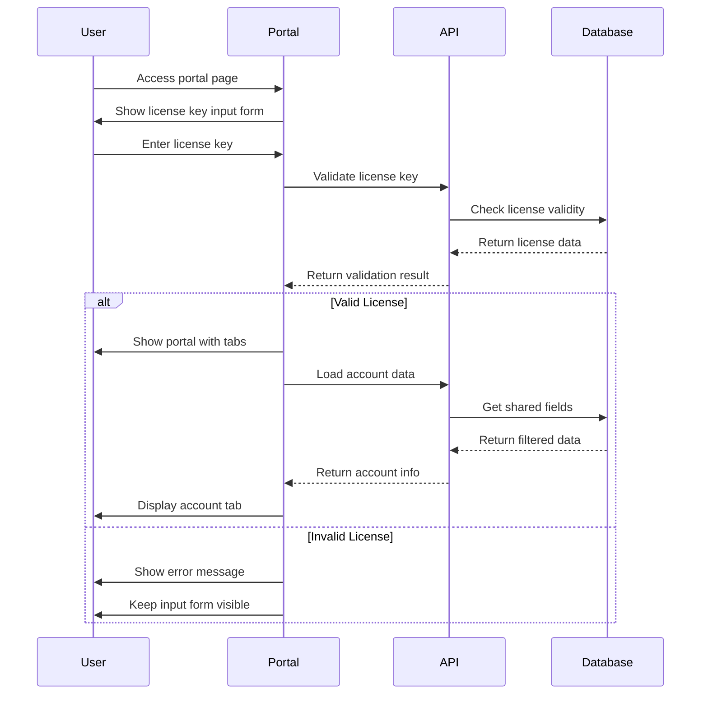

# VD License Manager - Frontend Portal UI Specifications

## Overview
Customer-facing portal interface specifications for the VD License Manager plugin, providing secure access to license information, account credentials, and device management through WordPress shortcodes.

## Shortcode Architecture

### Primary Shortcode: [vd_license_portal]

#### Basic Usage
```php
[vd_license_portal]
```

#### Advanced Configuration
```php
[vd_license_portal
    theme="modern"
    show_tabs="account,devices,history"
    default_tab="account"
    enable_copy="true"
    show_expiration="true"
    compact_view="false"
    language="auto"
]
```

#### Shortcode Parameters
```php
$default_atts = [
    // Visual Appearance
    'theme'           => 'modern',      // modern, classic, minimal, dark
    'compact_view'    => 'false',       // true/false - compact layout
    'show_header'     => 'true',        // true/false - portal header
    'show_footer'     => 'true',        // true/false - portal footer

    // Tab Configuration
    'show_tabs'       => 'account,devices,history', // comma-separated list
    'default_tab'     => 'account',     // default active tab
    'tab_position'    => 'top',         // top, left, bottom

    // Content Control
    'enable_copy'     => 'true',        // true/false - copy buttons
    'show_expiration' => 'true',        // true/false - expiration info
    'show_usage'      => 'true',        // true/false - usage statistics
    'show_qr_code'    => 'false',       // true/false - QR code generation

    // Behavior
    'auto_refresh'    => '300',         // seconds, 0 to disable
    'session_timeout' => '1800',        // seconds for session
    'require_2fa'     => 'false',       // true/false - 2FA requirement

    // Localization
    'language'        => 'auto',        // auto, en, vi, es, fr, de, etc.
    'date_format'     => 'auto',        // auto, Y-m-d, d/m/Y, m/d/Y
    'timezone'        => 'auto',        // auto, UTC, or timezone string

    // Advanced
    'custom_css'      => '',            // additional CSS classes
    'debug_mode'      => 'false',       // true/false - debug information
];
```

## User Experience Flow

### 1. License Key Entry Flow


### 2. Authentication Flow
```html
<div class="vd-portal-auth" id="vd-auth-form">
    <div class="auth-header">
        <h2>Access Your License Portal</h2>
        <p>Enter your license key to view account details and manage devices</p>
    </div>

    <form class="license-auth-form" method="post">
        <div class="form-group">
            <label for="license_key">License Key</label>
            <input type="text"
                   id="license_key"
                   name="license_key"
                   placeholder="Enter your license key"
                   class="license-key-input"
                   autocomplete="off"
                   required>
            <div class="input-hint">
                Format: XXXXXXXX-XXXX-XXXX-XXXX-XXXXXXXXXXXX
            </div>
        </div>

        <div class="form-actions">
            <button type="submit" class="vd-btn vd-btn-primary">
                <span class="btn-text">Access Portal</span>
                <span class="btn-loading" style="display:none">
                    <span class="spinner"></span> Validating...
                </span>
            </button>
        </div>

        <div class="auth-help">
            <details>
                <summary>Need help finding your license key?</summary>
                <div class="help-content">
                    <p>Your license key was provided when you purchased this product.</p>
                    <ul>
                        <li>Check your purchase confirmation email</li>
                        <li>Look in your account dashboard</li>
                        <li>Contact support if you cannot locate it</li>
                    </ul>
                </div>
            </details>
        </div>
    </form>

    <!-- Error Display -->
    <div class="auth-errors" style="display:none">
        <div class="error-message"></div>
        <div class="error-actions">
            <button type="button" class="retry-btn">Try Again</button>
        </div>
    </div>
</div>
```

## Portal Interface Layout

### Main Portal Container
```html
<div class="vd-license-portal theme-{theme}" id="vd-portal-main" style="display:none">
    <!-- Portal Header -->
    <div class="portal-header" data-show="{show_header}">
        <div class="license-info">
            <h3 class="license-title">{product_name} License</h3>
            <div class="license-key-display">
                <span class="key-label">License Key:</span>
                <code class="license-key">{masked_license_key}</code>
                <button class="copy-btn" data-copy="{full_license_key}">Copy</button>
            </div>
        </div>

        <div class="license-status">
            <span class="status-badge status-{status}">{status_label}</span>
            <div class="expiration-info" data-show="{show_expiration}">
                <span class="expires-label">Expires:</span>
                <time class="expires-date" datetime="{expires_iso}">{expires_formatted}</time>
                <span class="time-remaining">{time_remaining}</span>
            </div>
        </div>

        <div class="portal-actions">
            <button class="refresh-btn" title="Refresh Data">
                <span class="icon-refresh"></span>
            </button>
            <button class="logout-btn" title="Exit Portal">
                <span class="icon-logout"></span>
            </button>
        </div>
    </div>

    <!-- Tab Navigation -->
    <nav class="portal-tabs" data-position="{tab_position}">
        <ul class="tab-list" role="tablist">
            {if show_account_tab}
            <li class="tab-item">
                <button class="tab-button active"
                        role="tab"
                        data-tab="account"
                        id="tab-account">
                    <span class="tab-icon icon-account"></span>
                    <span class="tab-label">Account Details</span>
                </button>
            </li>
            {endif}

            {if show_devices_tab}
            <li class="tab-item">
                <button class="tab-button"
                        role="tab"
                        data-tab="devices"
                        id="tab-devices">
                    <span class="tab-icon icon-devices"></span>
                    <span class="tab-label">Devices</span>
                    <span class="tab-badge">{device_count}/{device_limit}</span>
                </button>
            </li>
            {endif}

            {if show_history_tab}
            <li class="tab-item">
                <button class="tab-button"
                        role="tab"
                        data-tab="history"
                        id="tab-history">
                    <span class="tab-icon icon-history"></span>
                    <span class="tab-label">Usage History</span>
                </button>
            </li>
            {endif}
        </ul>
    </nav>

    <!-- Tab Content -->
    <div class="portal-content">
        <!-- Account Details Tab -->
        <div class="tab-pane active" role="tabpanel" data-tab="account" id="pane-account">
            <!-- Account content here -->
        </div>

        <!-- Devices Tab -->
        <div class="tab-pane" role="tabpanel" data-tab="devices" id="pane-devices">
            <!-- Devices content here -->
        </div>

        <!-- History Tab -->
        <div class="tab-pane" role="tabpanel" data-tab="history" id="pane-history">
            <!-- History content here -->
        </div>
    </div>

    <!-- Portal Footer -->
    <div class="portal-footer" data-show="{show_footer}">
        <div class="footer-info">
            <span class="last-updated">Last updated: {last_updated}</span>
            <span class="auto-refresh" data-enabled="{auto_refresh}">
                Auto-refresh: {refresh_interval}s
            </span>
        </div>
    </div>
</div>
```

## Tab Content Specifications

### 1. Account Details Tab

#### Layout Structure
```html
<div class="account-details-content">
    <!-- Account Information Card -->
    <div class="account-card">
        <div class="card-header">
            <h4>Account Information</h4>
            <div class="card-actions">
                {if enable_copy}
                <button class="copy-all-btn" data-action="copy-all">
                    Copy All Details
                </button>
                {endif}
                {if show_qr_code}
                <button class="qr-code-btn" data-action="show-qr">
                    Show QR Code
                </button>
                {endif}
            </div>
        </div>

        <div class="card-body">
            <div class="account-fields">
                {foreach shared_fields}
                <div class="field-row" data-field="{field_key}">
                    <div class="field-info">
                        <label class="field-label">{field_label}</label>
                        {if field_description}
                        <div class="field-description">{field_description}</div>
                        {endif}
                    </div>

                    <div class="field-value">
                        <div class="value-container">
                            {if field_type == 'password'}
                            <input type="password"
                                   class="field-input password-field"
                                   value="{field_value}"
                                   readonly>
                            <button class="toggle-visibility"
                                    data-field="{field_key}"
                                    title="Show/Hide">
                                <span class="icon-eye"></span>
                            </button>
                            {else}
                            <input type="text"
                                   class="field-input"
                                   value="{field_value}"
                                   readonly>
                            {endif}

                            {if enable_copy}
                            <button class="copy-field-btn"
                                    data-value="{field_value}"
                                    data-field="{field_label}"
                                    title="Copy {field_label}">
                                <span class="icon-copy"></span>
                                <span class="copy-feedback">Copied!</span>
                            </button>
                            {endif}
                        </div>

                        {if field_type == 'url'}
                        <div class="field-actions">
                            <a href="{field_value}"
                               target="_blank"
                               rel="noopener noreferrer"
                               class="external-link-btn">
                                Open in New Tab
                                <span class="icon-external"></span>
                            </a>
                        </div>
                        {endif}
                    </div>
                </div>
                {endforeach}
            </div>

            <!-- Account Status Information -->
            <div class="account-status-info">
                <div class="status-row">
                    <span class="status-label">Account Status:</span>
                    <span class="status-value status-{account_status}">{account_status_label}</span>
                </div>

                {if show_usage}
                <div class="status-row">
                    <span class="status-label">Usage This Month:</span>
                    <span class="status-value">{monthly_usage}</span>
                </div>
                {endif}

                <div class="status-row">
                    <span class="status-label">Last Accessed:</span>
                    <span class="status-value">{last_access_date}</span>
                </div>
            </div>
        </div>
    </div>

    <!-- QR Code Modal -->
    {if show_qr_code}
    <div class="qr-modal" id="qr-code-modal" style="display:none">
        <div class="modal-content">
            <div class="modal-header">
                <h5>Account QR Code</h5>
                <button class="close-modal">&times;</button>
            </div>
            <div class="modal-body">
                <div class="qr-code-container">
                    <canvas id="qr-canvas"></canvas>
                </div>
                <p class="qr-description">
                    Scan this QR code to access your account information on mobile devices.
                </p>
            </div>
        </div>
    </div>
    {endif}
</div>
```

### 2. Devices Tab

#### Device List Layout
```html
<div class="devices-content">
    <div class="devices-header">
        <div class="device-summary">
            <h4>Registered Devices</h4>
            <div class="device-stats">
                <span class="device-count">{device_count} of {device_limit} devices</span>
                <div class="usage-bar">
                    <div class="usage-fill" style="width: {usage_percentage}%"></div>
                </div>
            </div>
        </div>

        <div class="device-actions">
            <button class="refresh-devices-btn">
                <span class="icon-refresh"></span>
                Refresh
            </button>
        </div>
    </div>

    <div class="devices-list">
        {if no_devices}
        <div class="no-devices-message">
            <div class="empty-state">
                <span class="empty-icon icon-devices"></span>
                <h5>No Devices Registered</h5>
                <p>When you use your license on a device, it will appear here.</p>
            </div>
        </div>
        {else}
        {foreach devices}
        <div class="device-card status-{status}" data-device-id="{id}">
            <div class="device-info">
                <div class="device-header">
                    <h5 class="device-name">{device_name}</h5>
                    <span class="device-status status-{status}">{status_label}</span>
                </div>

                <div class="device-details">
                    <div class="device-detail">
                        <span class="detail-label">Platform:</span>
                        <span class="detail-value">{platform} {platform_version}</span>
                    </div>

                    <div class="device-detail">
                        <span class="detail-label">Browser:</span>
                        <span class="detail-value">{browser} {browser_version}</span>
                    </div>

                    <div class="device-detail">
                        <span class="detail-label">Location:</span>
                        <span class="detail-value">{location}</span>
                    </div>

                    <div class="device-detail">
                        <span class="detail-label">First Used:</span>
                        <span class="detail-value">{first_used}</span>
                    </div>

                    <div class="device-detail">
                        <span class="detail-label">Last Active:</span>
                        <span class="detail-value">{last_active}</span>
                    </div>
                </div>

                {if status == 'pending'}
                <div class="device-pending">
                    <div class="pending-message">
                        <span class="icon-clock"></span>
                        This device is pending approval. You can still use your license normally.
                    </div>

                    <div class="approval-info">
                        <span class="risk-score">Risk Score: {risk_score}/100</span>
                        {if risk_score <= auto_approval_threshold}
                        <span class="auto-approval">Will be auto-approved</span>
                        {endif}
                    </div>
                </div>
                {endif}

                {if status == 'rejected'}
                <div class="device-rejected">
                    <div class="rejection-message">
                        <span class="icon-warning"></span>
                        This device has been rejected. Contact support if you believe this is an error.
                    </div>

                    {if rejection_reason}
                    <div class="rejection-reason">
                        Reason: {rejection_reason}
                    </div>
                    {endif}
                </div>
                {endif}
            </div>

            <div class="device-actions">
                {if is_current_device}
                <span class="current-device-badge">
                    <span class="icon-check"></span>
                    Current Device
                </span>
                {else}
                <div class="device-controls">
                    <!-- Read-only: No remove/edit actions -->
                    <button class="device-info-btn" data-device-id="{id}">
                        View Details
                    </button>
                </div>
                {endif}
            </div>
        </div>
        {endforeach}
        {endif}
    </div>

    <!-- Device Limit Warning -->
    {if device_count >= device_limit}
    <div class="device-limit-warning">
        <div class="warning-content">
            <span class="icon-warning"></span>
            <div class="warning-text">
                <strong>Device Limit Reached</strong>
                <p>You have reached the maximum number of devices ({device_limit}) for this license.
                   New devices will require manual approval.</p>
            </div>
        </div>
    </div>
    {endif}

    <!-- Device Information Modal -->
    <div class="device-modal" id="device-info-modal" style="display:none">
        <div class="modal-content">
            <div class="modal-header">
                <h5>Device Information</h5>
                <button class="close-modal">&times;</button>
            </div>
            <div class="modal-body">
                <div class="device-fingerprint">
                    <h6>Device Fingerprint</h6>
                    <div class="fingerprint-data">
                        <!-- Populated via AJAX -->
                    </div>
                </div>

                <div class="device-history">
                    <h6>Access History</h6>
                    <div class="history-list">
                        <!-- Populated via AJAX -->
                    </div>
                </div>
            </div>
        </div>
    </div>
</div>
```

### 3. Usage History Tab

#### History Timeline Layout
```html
<div class="history-content">
    <div class="history-header">
        <h4>Usage History</h4>
        <div class="history-filters">
            <select name="history_period" class="period-filter">
                <option value="7">Last 7 days</option>
                <option value="30" selected>Last 30 days</option>
                <option value="90">Last 90 days</option>
                <option value="365">Last year</option>
                <option value="all">All time</option>
            </select>

            <select name="history_type" class="type-filter">
                <option value="all">All Activities</option>
                <option value="access">License Access</option>
                <option value="device">Device Events</option>
                <option value="account">Account Changes</option>
            </select>
        </div>
    </div>

    <div class="history-stats">
        <div class="stats-grid">
            <div class="stat-card">
                <span class="stat-number">{total_accesses}</span>
                <span class="stat-label">Total Accesses</span>
            </div>

            <div class="stat-card">
                <span class="stat-number">{unique_devices}</span>
                <span class="stat-label">Unique Devices</span>
            </div>

            <div class="stat-card">
                <span class="stat-number">{active_days}</span>
                <span class="stat-label">Active Days</span>
            </div>

            <div class="stat-card">
                <span class="stat-number">{avg_daily_usage}</span>
                <span class="stat-label">Avg Daily Usage</span>
            </div>
        </div>
    </div>

    <div class="history-timeline">
        {if no_history}
        <div class="no-history-message">
            <div class="empty-state">
                <span class="empty-icon icon-history"></span>
                <h5>No Usage History</h5>
                <p>Your license usage history will appear here once you start using the service.</p>
            </div>
        </div>
        {else}
        <div class="timeline-container">
            {foreach history_items grouped_by_date}
            <div class="timeline-date">
                <div class="date-header">
                    <h5 class="date-title">{date_formatted}</h5>
                    <span class="date-count">{item_count} activities</span>
                </div>

                <div class="timeline-items">
                    {foreach date_items}
                    <div class="timeline-item type-{type}">
                        <div class="item-icon">
                            <span class="icon-{type}"></span>
                        </div>

                        <div class="item-content">
                            <div class="item-header">
                                <span class="item-title">{title}</span>
                                <time class="item-time">{time_formatted}</time>
                            </div>

                            <div class="item-description">{description}</div>

                            {if details}
                            <div class="item-details">
                                {foreach details}
                                <span class="detail-tag">{detail}</span>
                                {endforeach}
                            </div>
                            {endif}
                        </div>

                        {if location}
                        <div class="item-location">
                            <span class="icon-location"></span>
                            <span class="location-text">{location}</span>
                        </div>
                        {endif}
                    </div>
                    {endforeach}
                </div>
            </div>
            {endforeach}
        </div>

        <!-- Load More -->
        <div class="history-pagination">
            <button class="load-more-btn" data-page="{next_page}">
                Load More History
                <span class="loading-spinner" style="display:none"></span>
            </button>
        </div>
        {endif}
    </div>
</div>
```

## Copy-Only Functionality

### Copy System Implementation
```javascript
class VDCopyManager {
    constructor() {
        this.copyQueue = new Map();
        this.initEventListeners();
        this.initKeyboardShortcuts();
    }

    initEventListeners() {
        document.addEventListener('click', (e) => {
            if (e.target.matches('.copy-field-btn, .copy-all-btn')) {
                this.handleCopyClick(e);
            }
        });

        // Prevent context menu on sensitive fields
        document.addEventListener('contextmenu', (e) => {
            if (e.target.matches('.field-input')) {
                e.preventDefault();
            }
        });

        // Prevent drag/select on readonly fields
        document.addEventListener('selectstart', (e) => {
            if (e.target.matches('.field-input')) {
                e.preventDefault();
            }
        });
    }

    initKeyboardShortcuts() {
        document.addEventListener('keydown', (e) => {
            // Ctrl+C on focused field
            if (e.ctrlKey && e.key === 'c') {
                const focused = document.activeElement;
                if (focused.matches('.field-input')) {
                    e.preventDefault();
                    this.copyFieldValue(focused);
                }
            }

            // Ctrl+Shift+C to copy all
            if (e.ctrlKey && e.shiftKey && e.key === 'C') {
                e.preventDefault();
                this.copyAllFields();
            }
        });
    }

    async handleCopyClick(e) {
        e.preventDefault();
        const button = e.target.closest('button');

        if (button.classList.contains('copy-field-btn')) {
            await this.copyFieldValue(button);
        } else if (button.classList.contains('copy-all-btn')) {
            await this.copyAllFields();
        }
    }

    async copyFieldValue(element) {
        let value, fieldName;

        if (element.matches('.field-input')) {
            value = element.value;
            fieldName = element.closest('.field-row').dataset.field;
        } else {
            value = element.dataset.value;
            fieldName = element.dataset.field;
        }

        try {
            await navigator.clipboard.writeText(value);
            this.showCopyFeedback(element, fieldName);
            this.logCopyAction(fieldName, 'single');
        } catch (err) {
            this.fallbackCopy(value);
            this.showCopyFeedback(element, fieldName);
        }
    }

    async copyAllFields() {
        const fields = document.querySelectorAll('.field-row');
        const copyData = [];

        fields.forEach(row => {
            const label = row.querySelector('.field-label').textContent;
            const input = row.querySelector('.field-input');
            const value = input.value;

            copyData.push(`${label}: ${value}`);
        });

        const allData = copyData.join('\n');

        try {
            await navigator.clipboard.writeText(allData);
            this.showCopyFeedback(document.querySelector('.copy-all-btn'), 'All Fields');
            this.logCopyAction('all_fields', 'bulk');
        } catch (err) {
            this.fallbackCopy(allData);
            this.showCopyFeedback(document.querySelector('.copy-all-btn'), 'All Fields');
        }
    }

    fallbackCopy(text) {
        // Fallback for browsers that don't support clipboard API
        const textArea = document.createElement('textarea');
        textArea.value = text;
        textArea.style.position = 'fixed';
        textArea.style.left = '-999999px';
        textArea.style.top = '-999999px';
        document.body.appendChild(textArea);
        textArea.focus();
        textArea.select();

        try {
            document.execCommand('copy');
        } catch (err) {
            console.error('Fallback copy failed:', err);
        }

        document.body.removeChild(textArea);
    }

    showCopyFeedback(element, fieldName) {
        // Find or create feedback element
        let feedback = element.querySelector('.copy-feedback');
        if (!feedback) {
            feedback = document.createElement('span');
            feedback.className = 'copy-feedback';
            feedback.textContent = 'Copied!';
            element.appendChild(feedback);
        }

        // Show feedback animation
        feedback.style.display = 'inline';
        feedback.classList.add('show');

        // Update button text temporarily
        const originalText = element.textContent;
        element.textContent = `Copied ${fieldName}!`;
        element.classList.add('copied');

        setTimeout(() => {
            feedback.classList.remove('show');
            element.textContent = originalText;
            element.classList.remove('copied');

            setTimeout(() => {
                feedback.style.display = 'none';
            }, 200);
        }, 2000);
    }

    async logCopyAction(field, type) {
        try {
            await fetch(vd_portal_ajax.ajax_url, {
                method: 'POST',
                headers: {
                    'Content-Type': 'application/x-www-form-urlencoded',
                },
                body: new URLSearchParams({
                    action: 'vd_log_copy_action',
                    field: field,
                    type: type,
                    license_key: vd_portal_data.license_key,
                    _wpnonce: vd_portal_ajax.nonce
                })
            });
        } catch (err) {
            // Silent fail for logging
            console.warn('Copy action logging failed:', err);
        }
    }
}

// Initialize copy manager
document.addEventListener('DOMContentLoaded', () => {
    new VDCopyManager();
});
```

## Internationalization (i18n) Support

### Text Domain Setup
```php
// Plugin text domain
define('VD_LICENSE_MANAGER_TEXT_DOMAIN', 'vd-license-manager');

// Load translations
add_action('plugins_loaded', function() {
    load_plugin_textdomain(
        VD_LICENSE_MANAGER_TEXT_DOMAIN,
        false,
        dirname(plugin_basename(__FILE__)) . '/languages/'
    );
});
```

### Translation Strings
```php
// Portal interface strings
$portal_strings = [
    // Authentication
    'auth_title'           => __('Access Your License Portal', VD_LICENSE_MANAGER_TEXT_DOMAIN),
    'auth_description'     => __('Enter your license key to view account details and manage devices', VD_LICENSE_MANAGER_TEXT_DOMAIN),
    'license_key_label'    => __('License Key', VD_LICENSE_MANAGER_TEXT_DOMAIN),
    'license_key_placeholder' => __('Enter your license key', VD_LICENSE_MANAGER_TEXT_DOMAIN),
    'access_portal_btn'    => __('Access Portal', VD_LICENSE_MANAGER_TEXT_DOMAIN),
    'validating_text'      => __('Validating...', VD_LICENSE_MANAGER_TEXT_DOMAIN),

    // Portal header
    'license_title'        => __('%s License', VD_LICENSE_MANAGER_TEXT_DOMAIN), // %s = product name
    'license_key_display'  => __('License Key:', VD_LICENSE_MANAGER_TEXT_DOMAIN),
    'status_label'         => __('Status:', VD_LICENSE_MANAGER_TEXT_DOMAIN),
    'expires_label'        => __('Expires:', VD_LICENSE_MANAGER_TEXT_DOMAIN),
    'refresh_btn'          => __('Refresh Data', VD_LICENSE_MANAGER_TEXT_DOMAIN),
    'logout_btn'           => __('Exit Portal', VD_LICENSE_MANAGER_TEXT_DOMAIN),

    // Tabs
    'tab_account'          => __('Account Details', VD_LICENSE_MANAGER_TEXT_DOMAIN),
    'tab_devices'          => __('Devices', VD_LICENSE_MANAGER_TEXT_DOMAIN),
    'tab_history'          => __('Usage History', VD_LICENSE_MANAGER_TEXT_DOMAIN),

    // Account tab
    'account_info_title'   => __('Account Information', VD_LICENSE_MANAGER_TEXT_DOMAIN),
    'copy_all_btn'         => __('Copy All Details', VD_LICENSE_MANAGER_TEXT_DOMAIN),
    'show_qr_btn'          => __('Show QR Code', VD_LICENSE_MANAGER_TEXT_DOMAIN),
    'account_status'       => __('Account Status:', VD_LICENSE_MANAGER_TEXT_DOMAIN),
    'usage_this_month'     => __('Usage This Month:', VD_LICENSE_MANAGER_TEXT_DOMAIN),
    'last_accessed'        => __('Last Accessed:', VD_LICENSE_MANAGER_TEXT_DOMAIN),

    // Devices tab
    'devices_title'        => __('Registered Devices', VD_LICENSE_MANAGER_TEXT_DOMAIN),
    'device_count_text'    => __('%d of %d devices', VD_LICENSE_MANAGER_TEXT_DOMAIN),
    'no_devices_title'     => __('No Devices Registered', VD_LICENSE_MANAGER_TEXT_DOMAIN),
    'no_devices_text'      => __('When you use your license on a device, it will appear here.', VD_LICENSE_MANAGER_TEXT_DOMAIN),
    'device_pending'       => __('This device is pending approval.', VD_LICENSE_MANAGER_TEXT_DOMAIN),
    'device_rejected'      => __('This device has been rejected.', VD_LICENSE_MANAGER_TEXT_DOMAIN),
    'current_device'       => __('Current Device', VD_LICENSE_MANAGER_TEXT_DOMAIN),
    'device_limit_reached' => __('Device Limit Reached', VD_LICENSE_MANAGER_TEXT_DOMAIN),

    // History tab
    'history_title'        => __('Usage History', VD_LICENSE_MANAGER_TEXT_DOMAIN),
    'no_history_title'     => __('No Usage History', VD_LICENSE_MANAGER_TEXT_DOMAIN),
    'no_history_text'      => __('Your license usage history will appear here once you start using the service.', VD_LICENSE_MANAGER_TEXT_DOMAIN),
    'load_more_btn'        => __('Load More History', VD_LICENSE_MANAGER_TEXT_DOMAIN),

    // Status labels
    'status_active'        => __('Active', VD_LICENSE_MANAGER_TEXT_DOMAIN),
    'status_expired'       => __('Expired', VD_LICENSE_MANAGER_TEXT_DOMAIN),
    'status_suspended'     => __('Suspended', VD_LICENSE_MANAGER_TEXT_DOMAIN),
    'status_pending'       => __('Pending', VD_LICENSE_MANAGER_TEXT_DOMAIN),
    'status_approved'      => __('Approved', VD_LICENSE_MANAGER_TEXT_DOMAIN),
    'status_rejected'      => __('Rejected', VD_LICENSE_MANAGER_TEXT_DOMAIN),

    // Error messages
    'error_invalid_license' => __('Invalid license key. Please check and try again.', VD_LICENSE_MANAGER_TEXT_DOMAIN),
    'error_expired_license' => __('This license has expired.', VD_LICENSE_MANAGER_TEXT_DOMAIN),
    'error_suspended_license' => __('This license has been suspended.', VD_LICENSE_MANAGER_TEXT_DOMAIN),
    'error_network'        => __('Network error. Please try again later.', VD_LICENSE_MANAGER_TEXT_DOMAIN),

    // Copy feedback
    'copied_feedback'      => __('Copied!', VD_LICENSE_MANAGER_TEXT_DOMAIN),
    'copy_failed'          => __('Copy failed', VD_LICENSE_MANAGER_TEXT_DOMAIN),
];

// JavaScript localization
add_action('wp_enqueue_scripts', function() {
    wp_localize_script('vd-portal-script', 'vd_portal_i18n', [
        'copying'              => __('Copying...', VD_LICENSE_MANAGER_TEXT_DOMAIN),
        'copied'               => __('Copied!', VD_LICENSE_MANAGER_TEXT_DOMAIN),
        'copy_failed'          => __('Copy failed', VD_LICENSE_MANAGER_TEXT_DOMAIN),
        'loading'              => __('Loading...', VD_LICENSE_MANAGER_TEXT_DOMAIN),
        'error_occurred'       => __('An error occurred', VD_LICENSE_MANAGER_TEXT_DOMAIN),
        'confirm_logout'       => __('Are you sure you want to exit the portal?', VD_LICENSE_MANAGER_TEXT_DOMAIN),
        'session_expired'      => __('Your session has expired. Please log in again.', VD_LICENSE_MANAGER_TEXT_DOMAIN),
    ]);
});
```

### Language File Generation
```php
// Generate .pot file for translation
add_action('wp_ajax_vd_generate_pot', function() {
    if (!current_user_can('manage_options')) {
        wp_die('Access denied');
    }

    $plugin_dir = plugin_dir_path(__FILE__);
    $languages_dir = $plugin_dir . 'languages/';

    if (!is_dir($languages_dir)) {
        wp_mkdir_p($languages_dir);
    }

    // Use WordPress makepot or external tools
    $pot_file = $languages_dir . 'vd-license-manager.pot';

    // Extract strings from PHP files
    $strings = vd_extract_translation_strings($plugin_dir);

    // Generate .pot content
    $pot_content = vd_generate_pot_content($strings);

    file_put_contents($pot_file, $pot_content);

    wp_send_json_success(['message' => 'POT file generated successfully']);
});
```

## Theme System

### Theme Configuration
```php
$portal_themes = [
    'modern' => [
        'name' => 'Modern',
        'description' => 'Clean, modern interface with rounded corners and shadows',
        'css_file' => 'themes/modern.css',
        'colors' => [
            'primary' => '#0073aa',
            'secondary' => '#005177',
            'success' => '#46b450',
            'warning' => '#ffb900',
            'error' => '#dc3232',
        ]
    ],

    'classic' => [
        'name' => 'Classic',
        'description' => 'Traditional WordPress admin styling',
        'css_file' => 'themes/classic.css',
        'colors' => [
            'primary' => '#0073aa',
            'secondary' => '#23282d',
            'success' => '#46b450',
            'warning' => '#ffb900',
            'error' => '#dc3232',
        ]
    ],

    'minimal' => [
        'name' => 'Minimal',
        'description' => 'Clean, minimal design with subtle borders',
        'css_file' => 'themes/minimal.css',
        'colors' => [
            'primary' => '#333333',
            'secondary' => '#666666',
            'success' => '#28a745',
            'warning' => '#ffc107',
            'error' => '#dc3545',
        ]
    ],

    'dark' => [
        'name' => 'Dark',
        'description' => 'Dark theme for low-light environments',
        'css_file' => 'themes/dark.css',
        'colors' => [
            'primary' => '#0ea5e9',
            'secondary' => '#64748b',
            'success' => '#10b981',
            'warning' => '#f59e0b',
            'error' => '#ef4444',
        ]
    ]
];
```

### CSS Framework
```css
/* Base Portal Styles */
.vd-license-portal {
    --vd-primary-color: #0073aa;
    --vd-secondary-color: #005177;
    --vd-success-color: #46b450;
    --vd-warning-color: #ffb900;
    --vd-error-color: #dc3232;
    --vd-border-radius: 4px;
    --vd-box-shadow: 0 1px 3px rgba(0,0,0,0.1);
    --vd-transition: all 0.2s ease;
}

/* Theme Variations */
.vd-license-portal.theme-modern {
    --vd-border-radius: 8px;
    --vd-box-shadow: 0 4px 20px rgba(0,0,0,0.1);
}

.vd-license-portal.theme-minimal {
    --vd-border-radius: 2px;
    --vd-box-shadow: 0 1px 2px rgba(0,0,0,0.05);
}

.vd-license-portal.theme-dark {
    --vd-primary-color: #0ea5e9;
    --vd-secondary-color: #64748b;
    --vd-bg-primary: #1e293b;
    --vd-bg-secondary: #334155;
    --vd-text-primary: #f1f5f9;
    --vd-text-secondary: #cbd5e1;

    background: var(--vd-bg-primary);
    color: var(--vd-text-primary);
}

/* Responsive Design */
@media (max-width: 768px) {
    .vd-license-portal {
        padding: 1rem;
    }

    .portal-tabs[data-position="top"] .tab-list {
        flex-wrap: wrap;
        gap: 0.5rem;
    }

    .device-card,
    .account-card {
        margin-bottom: 1rem;
    }

    .field-row {
        flex-direction: column;
        gap: 0.5rem;
    }
}

@media (max-width: 480px) {
    .portal-header {
        flex-direction: column;
        gap: 1rem;
    }

    .license-info,
    .license-status {
        text-align: center;
    }

    .tab-button .tab-label {
        display: none;
    }
}
```

## Security Implementation

### Session Management
```php
class VD_Portal_Session {
    private $session_timeout = 1800; // 30 minutes
    private $session_key = 'vd_portal_session';

    public function create_session($license_key) {
        $session_data = [
            'license_key' => $license_key,
            'created_at' => time(),
            'last_activity' => time(),
            'ip_address' => $this->get_client_ip(),
            'user_agent' => $_SERVER['HTTP_USER_AGENT'] ?? '',
            'session_token' => wp_generate_password(32, false)
        ];

        // Store in database with expiration
        $this->store_session($session_data);

        // Set secure cookie
        $this->set_session_cookie($session_data['session_token']);

        return $session_data['session_token'];
    }

    public function validate_session($session_token = null) {
        if (!$session_token) {
            $session_token = $_COOKIE[$this->session_key] ?? null;
        }

        if (!$session_token) {
            return false;
        }

        $session = $this->get_session($session_token);
        if (!$session) {
            return false;
        }

        // Check timeout
        if (time() - $session['last_activity'] > $this->session_timeout) {
            $this->destroy_session($session_token);
            return false;
        }

        // Update last activity
        $this->update_session_activity($session_token);

        return $session;
    }

    private function set_session_cookie($token) {
        $secure = is_ssl();
        $httponly = true;
        $samesite = 'Strict';

        setcookie(
            $this->session_key,
            $token,
            time() + $this->session_timeout,
            '/',
            '',
            $secure,
            $httponly
        );
    }

    private function get_client_ip() {
        $headers = [
            'HTTP_CF_CONNECTING_IP',     // Cloudflare
            'HTTP_CLIENT_IP',            // Proxy
            'HTTP_X_FORWARDED_FOR',      // Load balancer/proxy
            'HTTP_X_FORWARDED',          // Proxy
            'HTTP_X_CLUSTER_CLIENT_IP',  // Cluster
            'HTTP_FORWARDED_FOR',        // Proxy
            'HTTP_FORWARDED',            // Proxy
            'REMOTE_ADDR'                // Standard
        ];

        foreach ($headers as $header) {
            if (!empty($_SERVER[$header])) {
                $ips = explode(',', $_SERVER[$header]);
                $ip = trim($ips[0]);

                if (filter_var($ip, FILTER_VALIDATE_IP, FILTER_FLAG_NO_PRIV_RANGE | FILTER_FLAG_NO_RES_RANGE)) {
                    return $ip;
                }
            }
        }

        return $_SERVER['REMOTE_ADDR'] ?? 'unknown';
    }
}
```

### CSRF Protection
```javascript
// CSRF token management
class VDCSRFProtection {
    constructor() {
        this.token = vd_portal_ajax.nonce;
        this.refreshInterval = 300000; // 5 minutes
        this.initTokenRefresh();
    }

    initTokenRefresh() {
        setInterval(() => {
            this.refreshToken();
        }, this.refreshInterval);
    }

    async refreshToken() {
        try {
            const response = await fetch(vd_portal_ajax.ajax_url, {
                method: 'POST',
                headers: {
                    'Content-Type': 'application/x-www-form-urlencoded',
                },
                body: new URLSearchParams({
                    action: 'vd_refresh_csrf_token',
                    _wpnonce: this.token
                })
            });

            const data = await response.json();
            if (data.success && data.data.token) {
                this.token = data.data.token;
                vd_portal_ajax.nonce = this.token;
            }
        } catch (err) {
            console.warn('CSRF token refresh failed:', err);
        }
    }

    getToken() {
        return this.token;
    }
}

// Initialize CSRF protection
const csrfProtection = new VDCSRFProtection();
```

## Acceptance Criteria

### Functional Requirements

1. **Shortcode Integration**
   - [ ] `[vd_license_portal]` shortcode renders correctly on any page/post
   - [ ] All shortcode parameters work as documented
   - [ ] Multiple instances on same page handled gracefully
   - [ ] Shortcode output cached appropriately to improve performance

2. **Authentication Flow**
   - [ ] License key validation works for all license statuses
   - [ ] Invalid keys show appropriate error messages
   - [ ] Expired licenses show expiration information
   - [ ] Rate limiting prevents brute force attempts

3. **Portal Interface**
   - [ ] All three tabs (Account, Devices, History) display correctly
   - [ ] Tab switching preserves user data and position
   - [ ] Auto-refresh updates content without losing user state
   - [ ] Responsive design works on all screen sizes (320px+)

4. **Account Details Tab**
   - [ ] Only configured shared fields are displayed
   - [ ] Password fields are masked by default with toggle visibility
   - [ ] Copy functionality works for individual fields and all data
   - [ ] QR code generation works when enabled
   - [ ] Field descriptions and help text display correctly

5. **Devices Tab**
   - [ ] All user devices display with accurate status information
   - [ ] Device limit progress bar updates correctly
   - [ ] Current device is clearly identified
   - [ ] Pending/rejected devices show appropriate messages
   - [ ] Device details modal shows complete fingerprint data

6. **History Tab**
   - [ ] Usage timeline displays chronologically
   - [ ] Filtering by date range and activity type works
   - [ ] Statistics cards show accurate data
   - [ ] Pagination loads additional history seamlessly
   - [ ] Empty state shows when no history exists

### Security Requirements

1. **Session Security**
   - [ ] Portal sessions timeout after configured period
   - [ ] Session tokens are cryptographically secure
   - [ ] Multiple concurrent sessions handled appropriately
   - [ ] Session data includes IP and user agent validation

2. **Data Protection**
   - [ ] No sensitive data stored in browser localStorage
   - [ ] Credentials not exposed in HTML source or JavaScript
   - [ ] Copy operations don't leak data through developer tools
   - [ ] All AJAX requests include proper nonce validation

3. **Access Control**
   - [ ] Portal only shows data for authenticated license
   - [ ] Cross-license data access prevented
   - [ ] Rate limiting applied to all portal endpoints
   - [ ] Audit logging captures all sensitive operations

### Performance Requirements

1. **Load Performance**
   - [ ] Initial portal load completes within 3 seconds
   - [ ] Tab switching responds within 500ms
   - [ ] Auto-refresh operations don't block user interface
   - [ ] Large device lists (50+) display smoothly

2. **Scalability**
   - [ ] Portal handles licenses with 100+ devices efficiently
   - [ ] History tab supports 10,000+ events with pagination
   - [ ] Multiple concurrent users don't impact performance
   - [ ] Database queries use appropriate caching

### User Experience Requirements

1. **Usability**
   - [ ] Interface intuitive for non-technical users
   - [ ] Loading states provide clear feedback
   - [ ] Error messages actionable and user-friendly
   - [ ] Copy operations provide immediate feedback

2. **Accessibility**
   - [ ] All interactive elements keyboard accessible
   - [ ] Screen readers can navigate entire interface
   - [ ] High contrast mode supported
   - [ ] Focus management works correctly with modals

3. **Mobile Experience**
   - [ ] Touch targets minimum 44px on mobile devices
   - [ ] Horizontal scrolling not required for core functions
   - [ ] Tab navigation optimized for touch interaction
   - [ ] Copy functionality works on mobile browsers

### Integration Requirements

1. **WordPress Integration**
   - [ ] Portal inherits site theme colors appropriately
   - [ ] Works with all major page builders
   - [ ] Compatible with caching plugins
   - [ ] Multisite installations supported

2. **Internationalization**
   - [ ] All user-facing text translatable
   - [ ] RTL languages supported
   - [ ] Date/time formatting respects locale settings
   - [ ] Number formatting follows locale conventions

3. **Theme Compatibility**
   - [ ] All four themes (modern, classic, minimal, dark) work correctly
   - [ ] Custom CSS parameters apply properly
   - [ ] Responsive breakpoints work in all themes
   - [ ] Dark theme accessible in low-light conditions

## Implementation Timeline

### Phase 1: Core Structure (Week 1)
- Set up shortcode registration and basic rendering
- Create session management system
- Build authentication flow with license validation
- Implement basic portal container with tabs

### Phase 2: Account Tab (Week 2)
- Build account details display with field filtering
- Implement copy functionality with security measures
- Add password field masking/revealing
- Create QR code generation feature

### Phase 3: Devices & History Tabs (Week 3)
- Create devices listing with status indicators
- Build usage history timeline with filtering
- Implement pagination and lazy loading
- Add device detail modal functionality

### Phase 4: Themes & Polish (Week 4)
- Implement all four visual themes
- Complete responsive design optimization
- Add internationalization support
- Performance testing and optimization

### Phase 5: Security & Testing (Week 5)
- Security audit and penetration testing
- Accessibility compliance testing
- Cross-browser compatibility testing
- User acceptance testing