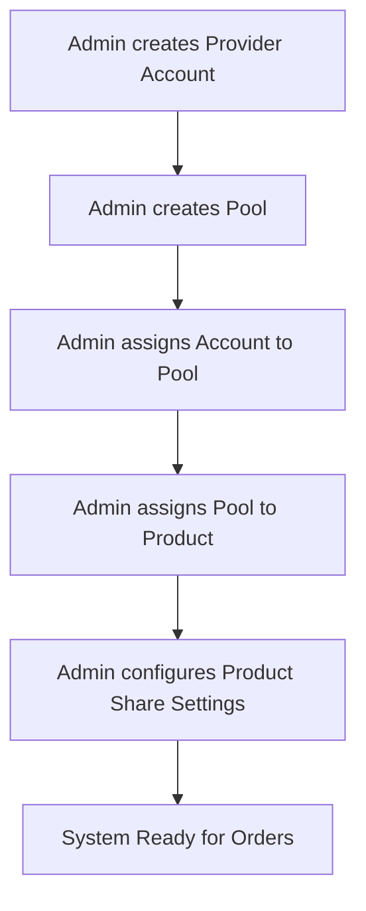
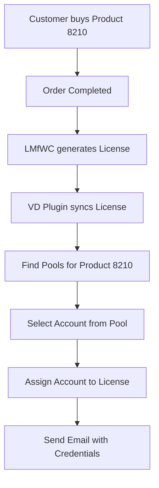
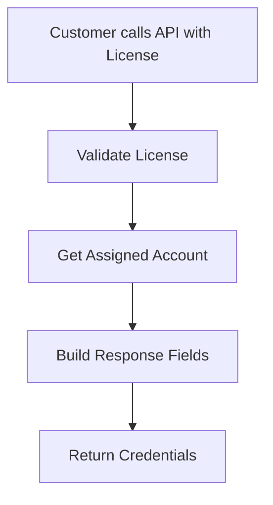

# 🔗 PRODUCTS ↔ POOLS ↔ ACCOUNTS RELATIONSHIP ANALYSIS

> **Mục đích:** Hiểu rõ logic liên kết giữa WooCommerce Products, Pools, và Provider Accounts
> **Phân tích:** Database schema + Business logic + Flow examples
> **Date:** 2025-10-14

---

## 📊 OVERVIEW - MỐI QUAN HỆ TỔNG QUAN

```
WooCommerce Products
        ↓ N:M (Many-to-Many)
    VD Pools
        ↓ N:M (Many-to-Many)
Provider Accounts
        ↓ N:1 (Many-to-One)
    VD Licenses
```

---

## 🗃️ DATABASE TABLES & RELATIONSHIPS

### **1️⃣ CORE ENTITIES**

#### **🛍️ WooCommerce Products (WordPress Native)**
```sql
wp_posts (WooCommerce Products)
├── ID (Primary Key)
├── post_title (Product Name)
├── post_type = 'product'
└── meta: _price, _stock_status, etc.
```

#### **🏊 VD Pools (bz_vd_pools)**
```sql
CREATE TABLE bz_vd_pools (
    id BIGINT UNSIGNED PRIMARY KEY,
    name VARCHAR(255) NOT NULL,                    -- "Helium10 Pool A", "Netflix Premium Pool"
    description TEXT,                              -- Pool description
    status ENUM('active','inactive') DEFAULT 'active',
    created_at DATETIME DEFAULT CURRENT_TIMESTAMP,
    updated_at DATETIME ON UPDATE CURRENT_TIMESTAMP
);
```

#### **👤 Provider Accounts (bz_vd_provider_accounts)**
```sql
CREATE TABLE bz_vd_provider_accounts (
    id BIGINT UNSIGNED PRIMARY KEY,
    provider VARCHAR(100) NOT NULL,               -- "Helium10", "Netflix", "ChatGPT"
    account_login VARCHAR(255) NOT NULL,          -- Email/username to login
    display_name VARCHAR(255),                    -- "John's Helium10 Account"
    account_password TEXT,                        -- Encrypted password
    capacity INT DEFAULT 1,                       -- Max licenses this account can serve
    status ENUM('active','inactive','suspended') DEFAULT 'active',
    expires_at DATETIME,                          -- Account expiration
    current_usage INT DEFAULT 0,                  -- Current active licenses using this account
    -- Encrypted credential fields:
    cookies LONGTEXT,                             -- Session cookies
    api_key TEXT,                                 -- API keys
    two_factor_secret TEXT,                       -- 2FA secrets
    custom_fields LONGTEXT,                       -- Additional JSON fields
    created_at DATETIME DEFAULT CURRENT_TIMESTAMP,
    UNIQUE KEY uk_provider_login (provider, account_login)
);
```

#### **🎫 VD License Keys (bz_vd_license_keys)**
```sql
CREATE TABLE bz_vd_license_keys (
    id BIGINT UNSIGNED PRIMARY KEY,
    license_key VARCHAR(255) NOT NULL,            -- Encrypted from LMfWC
    license_key_plain VARCHAR(255),               -- Plain text for API lookups
    lmfwc_license_id BIGINT UNSIGNED,             -- Link to LMfWC
    product_id BIGINT UNSIGNED NOT NULL,          -- WooCommerce Product ID
    order_id BIGINT UNSIGNED NOT NULL,            -- WooCommerce Order ID
    customer_id BIGINT UNSIGNED NOT NULL,         -- WordPress User ID
    customer_email VARCHAR(255) NOT NULL,         -- Customer email
    pool_id BIGINT UNSIGNED,                      -- ← ASSIGNED POOL
    account_id BIGINT UNSIGNED,                   -- ← ASSIGNED ACCOUNT
    status ENUM('active','inactive','expired','suspended') DEFAULT 'active',
    -- Configuration from product:
    max_devices INT DEFAULT 2,
    max_requests_per_day INT DEFAULT 10,
    expires_at DATETIME,
    created_at DATETIME DEFAULT CURRENT_TIMESTAMP
);
```

### **2️⃣ RELATIONSHIP MAPPING TABLES**

#### **🔗 Product → Pool Mapping (bz_vd_product_pools)**
```sql
CREATE TABLE bz_vd_product_pools (
    id BIGINT UNSIGNED PRIMARY KEY,
    product_id BIGINT UNSIGNED NOT NULL,          -- WooCommerce Product ID
    pool_id BIGINT UNSIGNED NOT NULL,             -- VD Pool ID
    priority TINYINT UNSIGNED DEFAULT 1,          -- Assignment priority (1=highest)
    assigned_at DATETIME DEFAULT CURRENT_TIMESTAMP,
    UNIQUE KEY uk_product_pool (product_id, pool_id),
    INDEX idx_product_id (product_id),
    INDEX idx_pool_id (pool_id),
    INDEX idx_priority (priority)
);
```

#### **🔗 Pool → Account Mapping (bz_vd_pool_accounts)**
```sql
CREATE TABLE bz_vd_pool_accounts (
    id BIGINT UNSIGNED PRIMARY KEY,
    pool_id BIGINT UNSIGNED NOT NULL,             -- VD Pool ID
    account_id BIGINT UNSIGNED NOT NULL,          -- Provider Account ID
    weight INT DEFAULT 1,                         -- For weighted distribution
    is_primary TINYINT(1) DEFAULT 0,              -- Primary account flag
    status ENUM('active','inactive') DEFAULT 'active',
    assigned_at DATETIME DEFAULT CURRENT_TIMESTAMP,
    UNIQUE KEY uk_pool_account (pool_id, account_id),
    INDEX idx_pool_id (pool_id),
    INDEX idx_account_id (account_id),
    INDEX idx_weight (weight)
);
```

#### **⚙️ Product Configuration (bz_vd_product_share_configs)**
```sql
CREATE TABLE bz_vd_product_share_configs (
    id BIGINT UNSIGNED PRIMARY KEY,
    product_id BIGINT UNSIGNED NOT NULL UNIQUE,   -- One config per product
    max_devices_per_license TINYINT UNSIGNED DEFAULT 2,
    device_reset_days SMALLINT UNSIGNED DEFAULT 7,
    max_requests_per_day SMALLINT UNSIGNED DEFAULT 10,
    response_fields JSON NOT NULL,                -- Which fields to show customer
    pool_assignment_rule ENUM('priority', 'round_robin', 'least_used') DEFAULT 'priority',
    is_active BOOLEAN DEFAULT TRUE,
    created_at DATETIME DEFAULT CURRENT_TIMESTAMP
);
```

---

## 🔄 BUSINESS LOGIC FLOW

### **📋 Setup Flow (Admin Configuration)**



#### **Step-by-Step:**

1. **Create Provider Account:**
   ```sql
   INSERT INTO bz_vd_provider_accounts
   (provider, account_login, account_password, capacity)
   VALUES ('Helium10', 'john@example.com', 'encrypted_pass', 5);
   ```

2. **Create Pool:**
   ```sql
   INSERT INTO bz_vd_pools (name, description)
   VALUES ('Helium10 Premium Pool', 'High-tier Helium10 accounts');
   ```

3. **Assign Account to Pool:**
   ```sql
   INSERT INTO bz_vd_pool_accounts (pool_id, account_id, weight)
   VALUES (1, 1, 10);  -- Higher weight = higher priority
   ```

4. **Assign Pool to Product:**
   ```sql
   INSERT INTO bz_vd_product_pools (product_id, pool_id, priority)
   VALUES (8210, 1, 1);  -- Product 8210 → Pool 1, Priority 1
   ```

5. **Configure Product Settings:**
   ```sql
   INSERT INTO bz_vd_product_share_configs
   (product_id, max_devices_per_license, response_fields)
   VALUES (8210, 2, '{"fields":[{"key":"cookie","label":"Session Cookie"}]}');
   ```

### **🛒 Customer Purchase Flow**



#### **Detailed SQL Queries:**

**1. Customer buys Product 8210:**
```sql
-- Order completion triggers license assignment
-- LMfWC creates license, VD syncs it
```

**2. Find Pools for Product:**
```sql
SELECT p.*, pp.priority
FROM bz_vd_pools p
INNER JOIN bz_vd_product_pools pp ON p.id = pp.pool_id
WHERE pp.product_id = 8210
  AND p.status = 'active'
ORDER BY pp.priority ASC;
```

**3. Find Available Account in Pool:**
```sql
SELECT a.*, pa.weight
FROM bz_vd_provider_accounts a
INNER JOIN bz_vd_pool_accounts pa ON a.id = pa.account_id
WHERE pa.pool_id = 1
  AND pa.status = 'active'
  AND a.status = 'active'
  AND a.current_usage < a.capacity  -- Has available slots
ORDER BY a.current_usage ASC, pa.weight DESC  -- Least used, highest weight
LIMIT 1;
```

**4. Assign Account to License:**
```sql
UPDATE bz_vd_license_keys
SET pool_id = 1, account_id = 1, assigned_at = NOW()
WHERE id = 123;

-- Update account usage
UPDATE bz_vd_provider_accounts
SET current_usage = current_usage + 1
WHERE id = 1;
```

### **🎯 API Access Flow (Customer Portal)**



#### **API Query Logic:**

**1. Validate License:**
```sql
SELECT * FROM bz_vd_license_keys
WHERE license_key_plain = 'H10D-8MR7-ABZ7-VRBO'
  AND status = 'active'
  AND (expires_at IS NULL OR expires_at > NOW());
```

**2. Get Account + Pool Info:**
```sql
SELECT
    l.*,
    a.provider, a.account_login, a.cookies, a.api_key,
    p.name as pool_name,
    c.response_fields, c.max_devices_per_license
FROM bz_vd_license_keys l
LEFT JOIN bz_vd_provider_accounts a ON l.account_id = a.id
LEFT JOIN bz_vd_pools p ON l.pool_id = p.id
LEFT JOIN bz_vd_product_share_configs c ON l.product_id = c.product_id
WHERE l.id = 123;
```

**3. Build Dynamic Response:**
```php
// Based on product_share_configs.response_fields JSON
$response_fields = json_decode($config['response_fields'], true);
$credentials = [];

foreach ($response_fields['fields'] as $field) {
    if ($field['key'] === 'cookie') {
        $credentials[$field['key']] = decrypt($account['cookies']);
    } elseif ($field['key'] === 'account_login') {
        $credentials[$field['key']] = $account['account_login'];
    }
    // ... other fields
}
```

---

## 📋 EXAMPLE SCENARIOS

### **Scenario 1: Multiple Products → Same Pool**

```sql
-- Product 8210 (Helium10 Basic) → Pool 1
INSERT INTO bz_vd_product_pools (product_id, pool_id, priority) VALUES (8210, 1, 1);

-- Product 8211 (Helium10 Premium) → Pool 1
INSERT INTO bz_vd_product_pools (product_id, pool_id, priority) VALUES (8211, 1, 1);

-- Both products share the same pool of Helium10 accounts
```

### **Scenario 2: One Product → Multiple Pools (Failover)**

```sql
-- Product 1357 → Pool A (Priority 1 - Primary)
INSERT INTO bz_vd_product_pools (product_id, pool_id, priority) VALUES (1357, 1, 1);

-- Product 1357 → Pool B (Priority 2 - Backup)
INSERT INTO bz_vd_product_pools (product_id, pool_id, priority) VALUES (1357, 2, 2);

-- If Pool A is full, use Pool B
```

### **Scenario 3: Account in Multiple Pools**

```sql
-- Account 5 in Pool A
INSERT INTO bz_vd_pool_accounts (pool_id, account_id, weight) VALUES (1, 5, 10);

-- Same Account 5 in Pool B (shared resource)
INSERT INTO bz_vd_pool_accounts (pool_id, account_id, weight) VALUES (2, 5, 5);

-- Account capacity still applies across all pools
```

### **Scenario 4: Weighted Distribution**

```sql
-- Pool with multiple accounts, different weights
INSERT INTO bz_vd_pool_accounts VALUES (1, 1, 1, 20, 0);  -- Account 1, Weight 20
INSERT INTO bz_vd_pool_accounts VALUES (1, 2, 2, 10, 0);  -- Account 2, Weight 10
INSERT INTO bz_vd_pool_accounts VALUES (1, 3, 3, 5, 0);   -- Account 3, Weight 5

-- Higher weight = higher chance of selection
-- Selection algorithm: weight / total_weight * 100%
```

---

## 🔧 ASSIGNMENT STRATEGIES

### **1. Priority Strategy (Default)**
```sql
-- Select pools by priority, accounts by least usage
SELECT a.* FROM bz_vd_provider_accounts a
INNER JOIN bz_vd_pool_accounts pa ON a.id = pa.account_id
INNER JOIN bz_vd_product_pools pp ON pa.pool_id = pp.pool_id
WHERE pp.product_id = ? AND a.current_usage < a.capacity
ORDER BY pp.priority ASC, a.current_usage ASC
LIMIT 1;
```

### **2. Round Robin Strategy**
```php
// PHP logic to track last assigned account per pool
$last_assigned = get_option("vd_pool_{$pool_id}_last_assigned", 0);
$next_account = ($last_assigned + 1) % $total_accounts_in_pool;
update_option("vd_pool_{$pool_id}_last_assigned", $next_account);
```

### **3. Least Used Strategy**
```sql
-- Always select account with lowest current usage
SELECT a.* FROM bz_vd_provider_accounts a
INNER JOIN bz_vd_pool_accounts pa ON a.id = pa.account_id
WHERE pa.pool_id = ? AND a.current_usage < a.capacity
ORDER BY a.current_usage ASC, pa.weight DESC
LIMIT 1;
```

### **4. Weighted Random Strategy**
```php
// PHP logic for weighted selection
$accounts = get_pool_accounts($pool_id);
$total_weight = array_sum(array_column($accounts, 'weight'));
$random = rand(1, $total_weight);

$cumulative = 0;
foreach ($accounts as $account) {
    $cumulative += $account['weight'];
    if ($random <= $cumulative) {
        return $account; // Selected!
    }
}
```

---

## 📊 CAPACITY MANAGEMENT

### **Account Capacity Logic:**
```sql
-- Check if account can take more licenses
SELECT
    a.id,
    a.capacity,
    a.current_usage,
    (a.capacity - a.current_usage) as available_slots
FROM bz_vd_provider_accounts a
WHERE a.current_usage < a.capacity  -- Has available capacity
  AND a.status = 'active';
```

### **Pool Capacity Check:**
```sql
-- Total capacity vs usage for entire pool
SELECT
    p.id as pool_id,
    p.name,
    SUM(a.capacity) as total_capacity,
    SUM(a.current_usage) as total_usage,
    (SUM(a.capacity) - SUM(a.current_usage)) as available_capacity
FROM bz_vd_pools p
INNER JOIN bz_vd_pool_accounts pa ON p.id = pa.pool_id
INNER JOIN bz_vd_provider_accounts a ON pa.account_id = a.id
WHERE p.id = 1 AND pa.status = 'active' AND a.status = 'active'
GROUP BY p.id;
```

---

## 🔍 TROUBLESHOOTING QUERIES

### **Find all relationships for a Product:**
```sql
SELECT
    pr.post_title as product_name,
    p.name as pool_name,
    a.provider, a.account_login, a.capacity, a.current_usage,
    pa.weight, pa.status as pool_account_status
FROM wp_posts pr
INNER JOIN bz_vd_product_pools pp ON pr.ID = pp.product_id
INNER JOIN bz_vd_pools p ON pp.pool_id = p.id
INNER JOIN bz_vd_pool_accounts pa ON p.id = pa.pool_id
INNER JOIN bz_vd_provider_accounts a ON pa.account_id = a.id
WHERE pr.ID = 8210 AND pr.post_type = 'product'
ORDER BY pp.priority, pa.weight DESC;
```

### **Find all licenses using an Account:**
```sql
SELECT
    l.license_key_plain,
    l.customer_email,
    l.status,
    l.assigned_at,
    pr.post_title as product_name
FROM bz_vd_license_keys l
INNER JOIN wp_posts pr ON l.product_id = pr.ID
WHERE l.account_id = 1
ORDER BY l.assigned_at DESC;
```

### **Check Pool utilization:**
```sql
SELECT
    p.name as pool_name,
    COUNT(l.id) as active_licenses,
    SUM(a.capacity) as total_capacity,
    (COUNT(l.id) / SUM(a.capacity) * 100) as utilization_percent
FROM bz_vd_pools p
LEFT JOIN bz_vd_pool_accounts pa ON p.id = pa.pool_id
LEFT JOIN bz_vd_provider_accounts a ON pa.account_id = a.id
LEFT JOIN bz_vd_license_keys l ON p.id = l.pool_id AND l.status = 'active'
WHERE p.id = 1
GROUP BY p.id;
```

---

## 🎯 KEY INSIGHTS

### **📋 Design Patterns:**

1. **Many-to-Many Flexibility:**
   - Products can use multiple pools (failover)
   - Pools can serve multiple products (efficiency)
   - Accounts can be in multiple pools (resource sharing)

2. **Priority-based Assignment:**
   - Pool priority (product level)
   - Account weight (pool level)
   - Usage-based balancing (account level)

3. **Dynamic Configuration:**
   - Response fields configurable per product
   - Rate limits and device limits per product
   - Assignment strategies per pool

4. **Capacity Management:**
   - Account-level capacity limits
   - Pool-level aggregated capacity
   - Real-time usage tracking

### **⚖️ Business Rules:**

- ✅ **One license** → **One account** (N:1)
- ✅ **One account** → **Multiple licenses** (1:N, up to capacity)
- ✅ **One product** → **Multiple pools** (N:M, with priority)
- ✅ **One pool** → **Multiple accounts** (N:M, with weight)
- ✅ **Account capacity** is global across all pools
- ✅ **Assignment is permanent** (no automatic rotation)

---

**📊 SUMMARY: Flexible multi-tier relationship system enabling complex business logic with simple administration!** 🚀