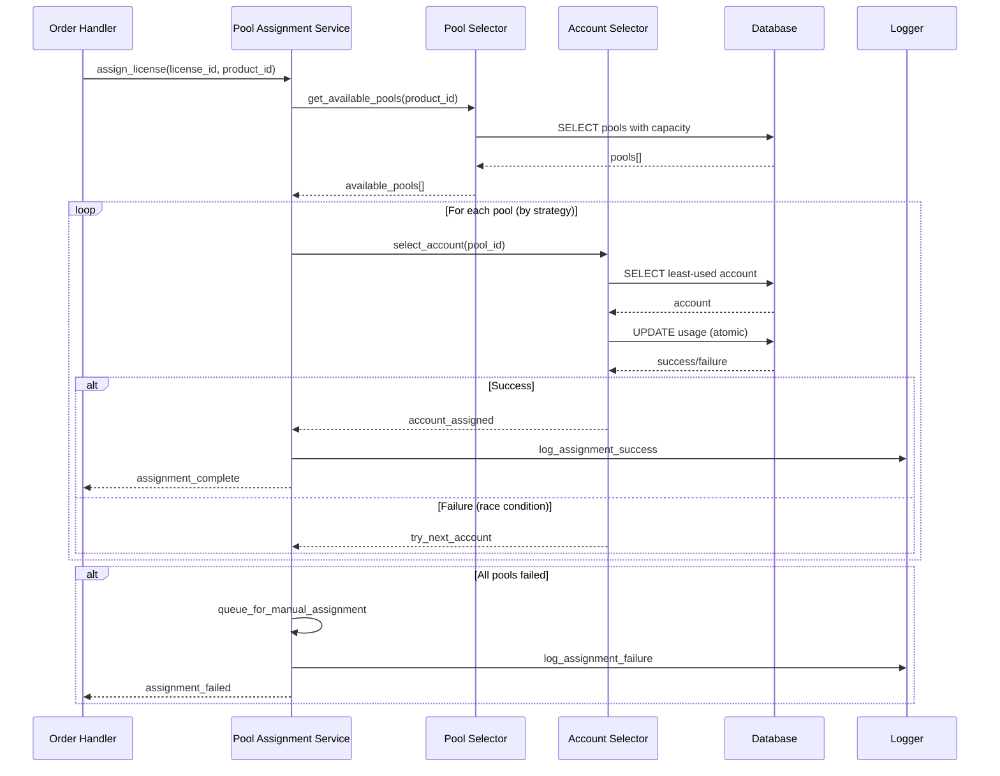
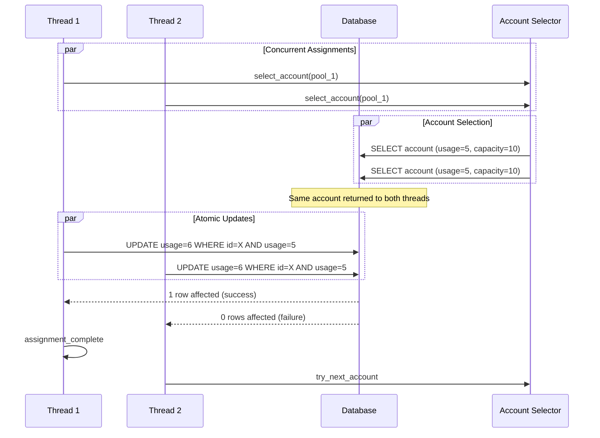
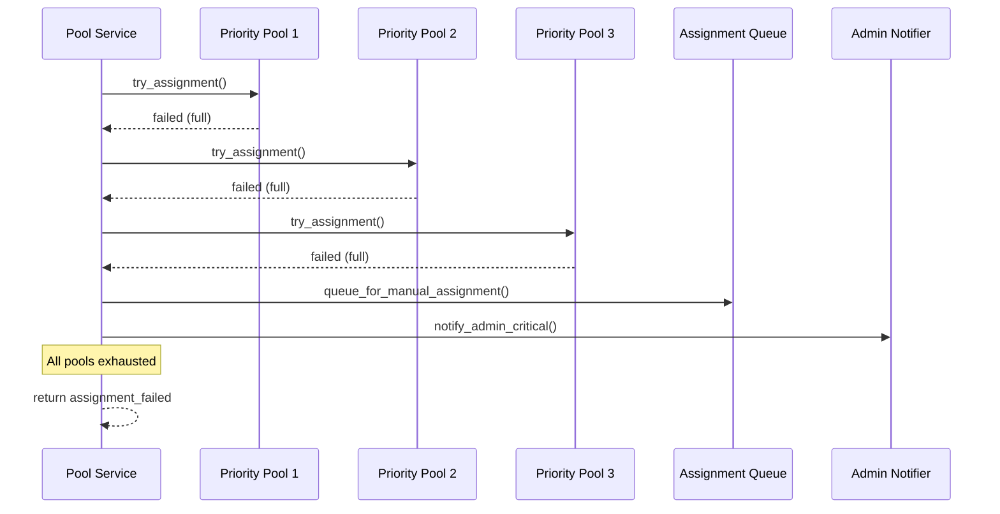
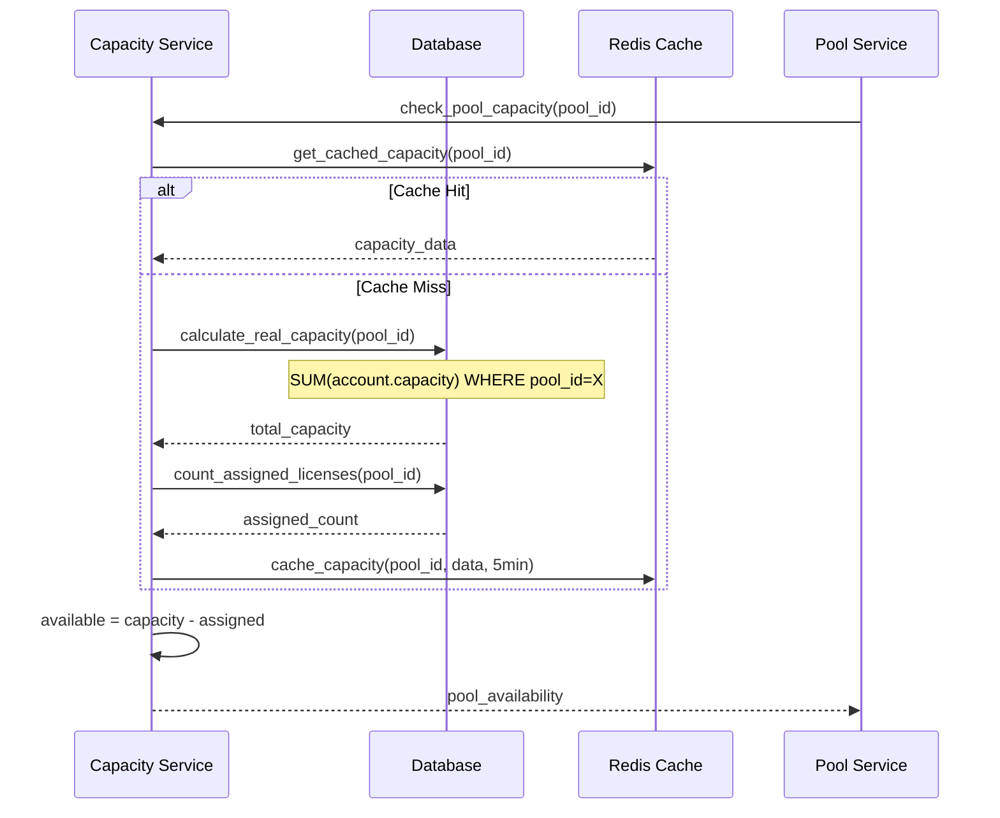
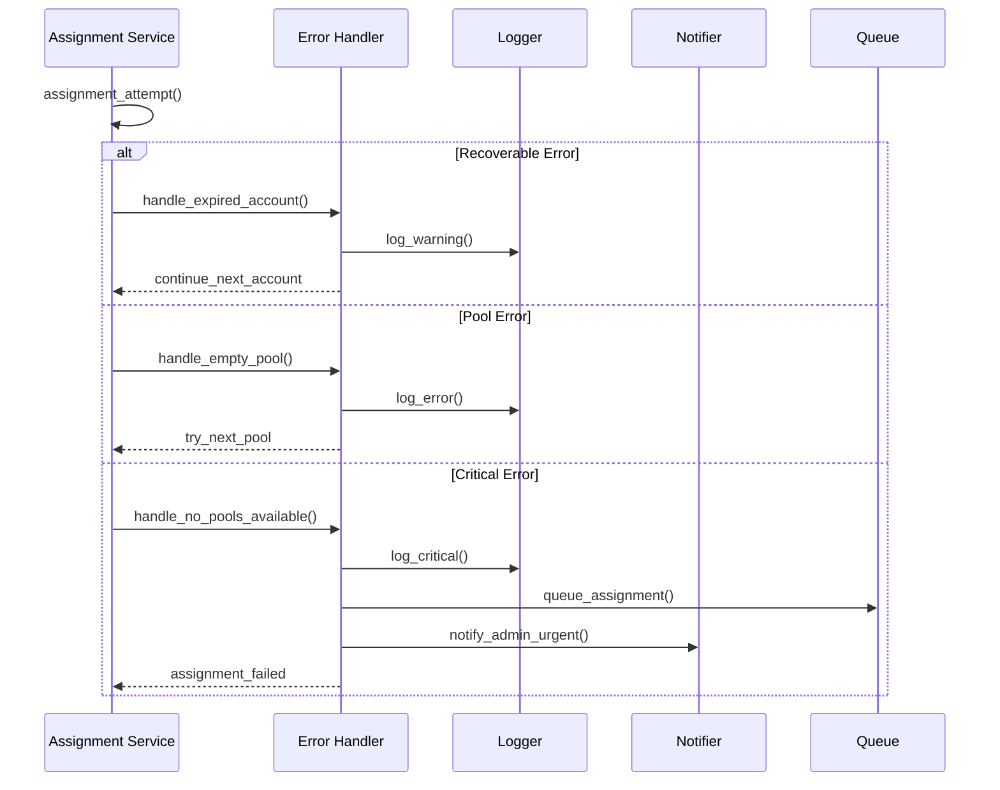
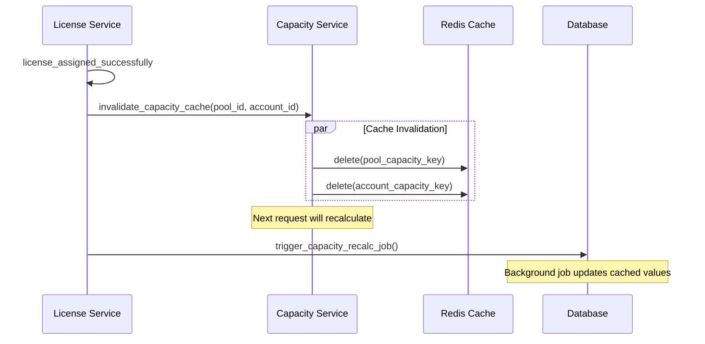

# Pool Assignment Sequence Diagrams

## 🔄 Primary Assignment Flow

## ⚡ Race Condition Handling

## 🔄 Fallback Chain Flow

## 📊 Capacity Calculation Flow

## 🚨 Error Handling Flow

## 🔄 Cache Invalidation Flow

