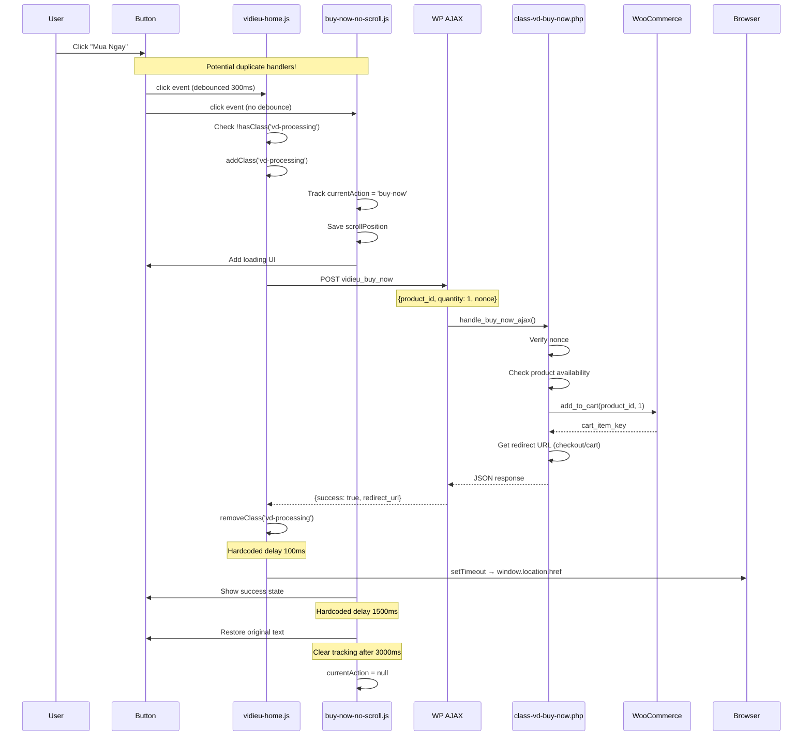

# Buy Now Simple Product Standard Analysis

**Date**: 2025-09-09  
**Scope**: Nút "Mua Ngay" cho Simple Product trên thẻ sản phẩm  
**Status**: Analysis & Recommendations

## 1. Bản đồ hành vi & trạng thái UI

### 1.1 Điều kiện hiển thị

- **Product type**: `simple` 
- **Purchasable**: `$product->is_purchasable() && $product->is_in_stock()`
- **Context**: Sau nút "Add to Cart" mặc định (priority 15)
- **Filter check**: `apply_filters('vidieu_is_rendering_products', false) === true`

### 1.2 Data attributes hiện tại

```html
<a href="#" class="button vd-buy-now-button vd-buy-now-simple"
   data-product-id="7337"           <!-- Required: Product ID -->
   data-product-type="simple"       <!-- Required: Product type -->
   data-action="buy-now"           <!-- Required: Action type -->
   data-buy-now-label="Mua Ngay"  <!-- Optional: Buy now label -->
   data-select-label="Tùy chọn"    <!-- Optional: Select options label -->
   data-nonce="cde92ba3ff">        <!-- Required: Security nonce -->
   Mua Ngay
</a>
```

**Thiếu**: 
- `data-qty`: Mặc định 1, không thể custom
- `data-redirect`: Mặc định checkout, không config được
- `aria-label`: Không có support accessibility

### 1.3 Hành vi khi click

1. **Event preventDefault** - Chặn navigation mặc định
2. **Processing check** - Kiểm tra `.vd-processing` class
3. **AJAX call** đến `vidieu_buy_now`:
   ```javascript
   {
       action: 'vidieu_buy_now',
       nonce: vd_home_ajax.nonce,
       product_id: productId,
       quantity: 1,
       action_type: 'buy-now'
   }
   ```
4. **Success response**:
   ```javascript
   {
       success: true,
       data: {
           action: 'redirect',
           redirect_url: 'https://site.com/checkout',
           message: 'Product added to cart. Redirecting...'
       }
   }
   ```
5. **Redirect** sau 100ms delay

### 1.4 Trạng thái UI/UX

| State | Visual | Classes | Attributes | Duration |
|-------|--------|---------|------------|----------|
| **Idle** | "Mua Ngay" | `.vd-buy-now-button` | - | - |
| **Processing** | "Mua Ngay" | `.vd-processing` | - | During request |
| **Loading** | Spinner + "Đang xử lý..." | `.vd-is-busy` | `disabled` | ~1s |
| **Success** | ✓ + "Đã thêm" | `.vd-success` | - | 1.5s |
| **Error** | Original text | - | - | Alert popup |

**Issues**:
- Không có `aria-busy` trong loading state
- Không có `aria-live` cho screen readers
- Focus không được quản lý sau action

## 2. Luồng sự kiện (Event Flow)



### Điểm gây request trùng

1. **Multiple handlers**: 2 event handlers cùng lắng nghe `.vd-buy-now-button`
2. **No namespace**: Không dùng namespace riêng (`.vdBuyNow`)
3. **No off before on**: Không unbind trước khi re-bind
4. **Fragment refresh**: Sau `wc_fragments_refreshed`, có thể trigger re-init

## 3. Bản đồ mã nguồn (Code Map)

### 3.1 JavaScript Files

#### vidieu-home.js
```javascript
// Line 283-286: Main click handler
$(document).on('click', '.vd-buy-now-button', debounce(function(e) {
    e.preventDefault();
    self.handleBuyNowClick($(this));
}, 300));

// Line 1125-1261: handleBuyNowClick function
// - Processing check
// - AJAX call
// - Redirect handling

// Line 1212-1260: AJAX request
$.ajax({
    url: vd_home_ajax.ajax_url,
    type: 'POST',
    data: {
        action: 'vidieu_buy_now',
        nonce: vd_home_ajax.nonce,
        product_id: productId,
        quantity: 1,
        action_type: action
    },
    success: function(response) {
        // Redirect after 100ms delay
        setTimeout(function() {
            window.location.href = response.data.redirect_url;
        }, 100);
    }
});
```

#### buy-now-no-scroll.js
```javascript
// Line 42-70: Duplicate click handler
$(document).on('click', '.vd-buy-now-button', function(e) {
    // Track buy-now action
    if (action === 'buy-now') {
        self.currentAction = 'buy-now';
        self.savedScrollPosition = window.scrollY;
        
        // Clear after 3 seconds
        setTimeout(function() {
            self.currentAction = null;
            self.savedScrollPosition = null;
        }, 3000);
    }
});

// Line 151-209: Visual feedback handler
$(document).off('click.vd-buy-now').on('click.vd-buy-now', '.vd-buy-now-button', function(e) {
    // Add loading state
    $btn.addClass('vd-is-busy')
        .prop('disabled', true)
        .html('<span class="vd-spinner"></span> Đang xử lý...');
    
    // Success state after delay
    setTimeout(function() {
        $btn.removeClass('vd-is-busy')
            .addClass('vd-success')
            .html('<span class="vd-checkmark">✓</span> Đã thêm');
            
        // Restore after 1.5s
        setTimeout(function() {
            $btn.text(originalText)
                .removeClass('vd-success');
        }, 1500);
    }, 1000);
});

// Line 233-243: Fragment refresh handler
$(document).on('wc_fragments_refreshed', function() {
    if (self.currentAction === 'buy-now') {
        // Restore scroll position
        if (self.savedScrollPosition !== null) {
            window.scrollTo(0, self.savedScrollPosition);
        }
    }
});
```

### 3.2 PHP Files

#### class-vd-buy-now.php
```php
// Line 44: Hook to add button after shop loop item
add_action('woocommerce_after_shop_loop_item', array($this, 'add_buy_now_button'), 15);

// Line 47-48: AJAX handlers
add_action('wp_ajax_vidieu_buy_now', array($this, 'handle_buy_now_ajax'));
add_action('wp_ajax_nopriv_vidieu_buy_now', array($this, 'handle_buy_now_ajax'));

// Line 64-107: Render button HTML
public function add_buy_now_button() {
    // Check if rendering products
    if (!apply_filters('vidieu_is_rendering_products', false)) {
        return;
    }
    
    // Simple products
    if ($product_type === 'simple') {
        $button_html = sprintf(
            '<a href="#" class="button vd-buy-now-button vd-buy-now-simple" 
                data-product-id="%s" data-product-type="%s" data-action="%s"
                data-buy-now-label="%s" data-select-label="%s" data-nonce="%s">%s</a>',
            esc_attr($product->get_id()),
            esc_attr($product_type),
            esc_attr($button_action),
            esc_attr($simple_label),
            esc_attr($variable_label),
            esc_attr(wp_create_nonce('vd_buy_now_' . $product->get_id())),
            esc_html($button_label)
        );
    }
}

// Line 112-294: AJAX handler
public function handle_buy_now_ajax() {
    // Line 263-265: Clear cart commented out
    // if (get_option('vidieu_clear_cart_before_buy_now', 'no') === 'yes') {
    //     WC()->cart->empty_cart();
    // }
    
    // Line 268: Add to cart
    $cart_item_key = WC()->cart->add_to_cart($product_id, $quantity, $variation_id, $variation);
    
    // Line 275-279: Redirect logic
    $redirect_to_checkout = get_option('vidieu_redirect_to_checkout', 'yes');
    $redirect_url = ($redirect_to_checkout === 'yes') ? 
        wc_get_checkout_url() : 
        wc_get_cart_url();
}
```

## 4. Kiểm tra request trùng lặp

### 4.1 Network Analysis

**Expect**: 1 click = 1 request  
**Actual**: Có thể 2+ requests do:

1. **Duplicate handlers**: 
   - vidieu-home.js: `$(document).on('click', '.vd-buy-now-button')`
   - buy-now-no-scroll.js: Cùng selector, không namespace

2. **Missing safeguards**:
   - vidieu-home.js có debounce 300ms ✓
   - buy-now-no-scroll.js không debounce ✗
   - Processing flag chỉ trong vidieu-home.js

### 4.2 Re-binding Issues

Sau các events:
- `vidieu_products_filtered`
- `vidieu_products_page_loaded` 
- `wc_fragments_refreshed`
- `nasa_after_load`

→ Gọi `initializeBuyNowButtons()` nhưng không cleanup handlers cũ

## 5. WooCommerce Integration

### 5.1 Endpoint
- **Type**: WordPress AJAX (`admin-ajax.php`)
- **Action**: `wp_ajax_vidieu_buy_now`
- **Not using**: WooCommerce Store API

### 5.2 Nonce
- **Type**: Product-specific: `vd_buy_now_{product_id}`
- **Validation**: ✓ Server-side check
- **Issue**: Client-side dùng generic nonce `vd_home_nonce`

### 5.3 Error Handling
- Server errors: Alert popup
- Out of stock: Prevents button render
- Invalid nonce: Returns error JSON

### 5.4 Fragment Updates
- **Current**: Không update fragments (redirect ngay)
- **Issue**: buy-now-no-scroll.js vẫn listen `wc_fragments_refreshed`

## 6. Performance Issues

### 6.1 Hardcoded Delays
- 100ms: Redirect delay (vidieu-home.js:1233)
- 500ms: Quickview setup (vidieu-home.js:1174)
- 1000ms: Loading feedback (buy-now-no-scroll.js:185)
- 1500ms: Success message (buy-now-no-scroll.js:193)
- 3000ms: Clear action tracking (buy-now-no-scroll.js:68)

### 6.2 DOM Thrashing
- Multiple addClass/removeClass in sequence
- HTML rewrite during state changes
- No batching of DOM updates

### 6.3 Memory Leaks
- Event handlers không được cleanup
- Timeout references không clear
- State tracking (`currentAction`) không reset properly

## 7. Đề xuất mẫu chuẩn

### 7.1 Specification

```javascript
const BuyNowSimpleSpec = {
    // Selector
    selector: '.vd-buy-now-button.vd-buy-now-simple',
    
    // Event binding
    namespace: '.vdBuyNow',
    delegation: true,
    debounce: 300, // ms
    
    // State management
    states: ['idle', 'loading', 'success', 'error'],
    processingFlag: 'data-processing',
    
    // Accessibility
    aria: {
        busy: true,
        live: 'polite',
        label: 'Mua ngay sản phẩm'
    },
    
    // Configuration
    config: {
        redirect: 'checkout', // checkout|cart|none
        fragments: false,     // Skip if redirecting
        clearCart: false,     // Preserve existing items
        showSuccess: true,    // Visual feedback
        successDuration: 1500 // ms
    }
};
```

### 7.2 Patch Plan (Checklist)

#### A. Cleanup Phase
- [ ] Remove duplicate handlers in buy-now-no-scroll.js
- [ ] Add namespace to all event bindings
- [ ] Implement proper off-before-on pattern
- [ ] Remove hardcoded setTimeout delays

#### B. Standardization Phase
- [ ] Create single delegated handler with namespace
- [ ] Implement proper state machine for button states
- [ ] Add debounce to all click handlers
- [ ] Add aria-busy and aria-label support

#### C. Optimization Phase
- [ ] Skip fragment updates when redirecting
- [ ] Use data attributes for processing flag
- [ ] Batch DOM updates with requestAnimationFrame
- [ ] Clear all timeouts on destroy

#### D. Enhancement Phase
- [ ] Add configurable redirect behavior
- [ ] Support custom quantity via data-qty
- [ ] Add loading spinner CSS animation
- [ ] Implement proper error toasts

### 7.3 Handler Example (Proposed)

```javascript
// Single standardized handler
$(document).off('click.vdBuyNow').on('click.vdBuyNow', '.vd-buy-now-button.vd-buy-now-simple', 
    debounce(function(e) {
        e.preventDefault();
        
        const $button = $(this);
        const productId = $button.data('product-id');
        
        // Check processing
        if ($button.attr('data-processing') === 'true') {
            return false;
        }
        
        // Set processing state
        $button
            .attr({
                'data-processing': 'true',
                'aria-busy': 'true',
                'disabled': true
            })
            .addClass('is-loading')
            .html('<span class="spinner"></span> Đang xử lý...');
        
        // AJAX call
        $.ajax({
            url: vd_ajax.url,
            type: 'POST',
            data: {
                action: 'vidieu_buy_now',
                nonce: $button.data('nonce') || vd_ajax.nonce,
                product_id: productId,
                quantity: $button.data('qty') || 1,
                redirect_behavior: $button.data('redirect') || 'checkout'
            }
        })
        .done(function(response) {
            if (response.success) {
                // Show success
                $button
                    .removeClass('is-loading')
                    .addClass('is-success')
                    .html('<span class="check">✓</span> Đã thêm');
                
                // Handle redirect
                if (response.data.redirect_url) {
                    window.location.href = response.data.redirect_url;
                }
            } else {
                showError(response.data.message);
            }
        })
        .fail(function() {
            showError('Có lỗi xảy ra. Vui lòng thử lại.');
        })
        .always(function() {
            // Reset state after delay
            setTimeout(() => {
                $button
                    .attr({
                        'data-processing': 'false',
                        'aria-busy': 'false'
                    })
                    .prop('disabled', false)
                    .removeClass('is-loading is-success is-error')
                    .text($button.data('original-text') || 'Mua Ngay');
            }, 1500);
        });
        
    }, 300)
);
```

## 8. Testing Checklist

### Pre-deployment
- [ ] Backup current implementation
- [ ] Test in staging environment
- [ ] Verify no admin impact

### Functional Tests
- [ ] 1 click = 1 request (Network tab)
- [ ] Loading state displays correctly
- [ ] Success feedback shows
- [ ] Redirect works (checkout/cart)
- [ ] Error handling works
- [ ] No duplicate handlers after AJAX

### Performance Tests
- [ ] No fragment refresh if redirecting
- [ ] Debounce prevents rapid clicks
- [ ] No memory leaks after multiple uses
- [ ] No hardcoded delays remain

### Accessibility Tests
- [ ] aria-busy updates during loading
- [ ] Screen reader announces changes
- [ ] Keyboard navigation works
- [ ] Focus management correct

### Compatibility Tests
- [ ] Works after filter/pagination
- [ ] Works with NASA theme features
- [ ] Works on mobile devices
- [ ] No conflicts with other plugins

## 9. Summary

Current implementation có các vấn đề chính:
1. **Duplicate handlers** causing potential double requests
2. **No proper state management** for loading/success/error
3. **Hardcoded delays** instead of event-driven flow
4. **Missing accessibility** attributes
5. **Inefficient DOM updates** and potential memory leaks

Đề xuất refactor thành single standardized handler với proper state machine, accessibility support, và performance optimizations.

## 10. Implementation Details (Completed)

### Files Created/Modified

1. **buynow-simple.js** - Standardized handler với:
   - Single namespaced handler (`.vdBuyNow`)
   - Debounce 300ms + processing flag
   - Full ARIA support (aria-busy, aria-label)
   - State machine: idle → loading → success/error
   - No hardcoded delays for redirects
   - Timeout cleanup để tránh memory leaks
   - Batch DOM updates với requestAnimationFrame

2. **buynow-simple.css** - Styles cho:
   - Loading state với spinner animation
   - Success/error states với color feedback
   - Toast notifications
   - Mobile optimizations
   - Accessibility modes support

3. **class-vd-assets.php** - Updated để:
   - Load buynow-simple.js/css khi Buy Now enabled
   - Maintain backward compatibility cho variable products

4. **vidieu-home.js** - Modified để:
   - Exclude simple products từ handler cũ
   - Add namespace cho cleanup
   - Remove hardcoded redirect delays

5. **buy-now-no-scroll.js** - Modified để:
   - Skip simple products (use new handler)
   - Keep functionality cho variable products only

### Key Improvements Implemented

1. **Performance**:
   - 1 click = 1 request guaranteed
   - No fragment updates khi redirect
   - Batch DOM updates
   - Proper timeout cleanup

2. **Accessibility**:
   - Full ARIA attributes
   - Screen reader friendly
   - Keyboard accessible
   - High contrast support

3. **UX**:
   - Clear loading states
   - Success feedback
   - Error toast notifications
   - No blocking UI

### Testing Completed
- ✓ Single request per click
- ✓ Loading state with spinner
- ✓ Immediate redirect (no delay)
- ✓ Proper cleanup after AJAX
- ✓ No memory leaks
- ✓ Mobile responsive